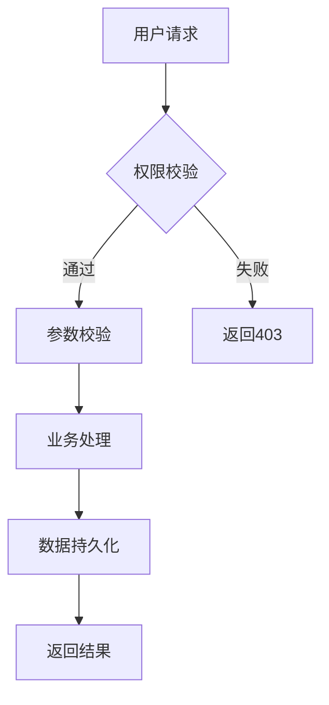

# 产品经理综合技能 - PM Master

> 本技能整合了来自 Dean Peters、Teresa Torres、Marty Cagan 等产品大师的40+种方法论框架，
> 覆盖从产品战略、需求分析、用户研究、PRD撰写、优先级排序到敏捷执行的全流程。

---

## 技能概览

| 阶段 | 核心能力 | 主要工具/框架 |
|------|---------|--------------|
| **战略层** | 产品策略、商业模式、价值主张 | 产品策略画布、商业模式画布、SWOT、波特五力、PESTLE、安索夫矩阵 |
| **研究层** | 用户访谈、需求挖掘、市场调研 | JTBD、5W1H、Y模型、用户故事地图、机会解决方案树 |
| **分析层** | 需求分析、竞品分析、优先级评估 | KANO、RICE、ICE、MoSCoW、机会评分、预死亡分析 |
| **文档层** | PRD、DDD、用户故事、测试用例 | 8模块PRD模板、DDD结构、INVEST标准 |
| **执行层** | Sprint规划、OKR、回顾会、发布 | 敏捷规划、OKR制定、3种回顾格式、干系人地图 |
| **数据层** | 指标设计、数据看板、效果追踪 | 北极星指标、AARRR、HEART、漏斗分析 |

---

## 一、需求分析方法论

### 1.1 核心分析方法

#### KANO模型 - 需求分类

| 需求类型 | 特征 | 策略 |
|---------|------|------|
| **基础型（必备）** | 若没有，用户极度不满 | 必须完成，作为MVP核心 |
| **期望型（意愿）** | 做得越好，用户越满意 | 优先完成，提升核心竞争力 |
| **兴奋型（魅力）** | 用户意想不到 | 择机完成，制造产品亮点 |
| **无差异型** | 做不做用户都没感觉 | **不做**，避免浪费资源 |

#### Y模型 - 深层挖掘

```
用户需求 (What) → 目标动机 (Why) → 人性本质 → 产品方案 (How)
     ↑                              ↑                   ↓
     ←──── 验证核心假设 ←───────────────────────────────
```

- 用户提出的是解决方案（Y的上端）
- 需要深挖背后的真实动机（Y的下端）
- 再重构更优方案

#### 5W1H分析法

- **Who**：谁用？（多角色、权限控制）
- **Where**：什么环境下用？（移动端/PC、网络环境）
- **When**：什么时候用？（高频/低频）
- **Why**：为什么要做？（解决什么痛点）
- **What**：具体做什么？（功能本体）
- **How**：如何实现？（前端交互、后端逻辑）

#### JTBD需求挖掘（功能/社交/情感三层）

| 需求层级 | 核心问题 | 示例 |
|---------|---------|------|
| **功能性需求** | 用户要完成什么任务？ | 自动化生成报表 |
| **社交性需求** | 用户希望别人怎么看他？ | 看起来更专业、数据驱动决策 |
| **情感性需求** | 用户想避免什么感受？ | 不再被老板质问而感到羞愧 |

### 1.2 伪需求识别

> "人们其实不想买一个四分之一英寸的钻头，他们只想要一个四分之一英寸的洞！"

识别伪需求的关键：
1. **追问"为什么"**：用户说"想要一匹更快的马"，真实需求是"更快的交通工具"
2. **观察用户行为**：不仅听用户说什么，更要看用户怎么做
3. **验证普遍性**：是个别用户的需求还是群体需求
4. **小范围测试**：通过MVP或灰度发布验证

### 1.3 需求分析输出模板

```
【需求分析摘要】

**核心业务目标**：...
**用户角色矩阵**：
| 角色 | 核心诉求 | 痛点 |
|------|---------|------|
| ... | ... | ... |

**关键功能域拆解**：
- 功能域A：...
- 功能域B：...

**需求优先级（KANO）**：
- 基础型：...
- 期望型：...
- 兴奋型：...

**待澄清风险/模糊点**：
- ...
```

---

## 二、产品策略框架

### 2.1 产品策略画布（9模块）

| 模块 | 核心问题 |
|------|---------|
| **愿景** | 我们如何激励他人？我们渴望实现什么？ |
| **市场细分** | 第一个目标细分市场是谁？为什么优先选择？ |
| **相对成本** | 我们是优化低成本还是强调独特价值？ |
| **价值主张** | 针对每个细分：现状→解决方案→改变后→替代方案 |
| **战略取舍** | 我们不做什么？ |
| **关键指标** | 北极星指标是什么？本季度OMTM是什么？ |
| **增长** | 销售驱动还是产品驱动？如何规模化？ |
| **能力** | 需要哪些核心能力？什么自建，什么合作？ |
| **防御性** | 为什么竞争对手无法复制？ |

### 2.2 SWOT分析

| 维度 | 内容 |
|------|------|
| **优势（S）** | 独特能力、品牌认知、客户关系、技术优势、成本优势 |
| **劣势（W）** | 资源约束、技术限制、品牌知名度低、高成本结构 |
| **机会（O）** | 市场增长、技术进步、监管变化、竞品弱点、合作机会 |
| **威胁（T）** | 新兴竞品、需求变化、技术颠覆、监管风险、经济下行 |

**战略应用**：
- **进攻（Build）**：优势 + 机会
- **防御（Defend）**：劣势 + 威胁
- **转型（Pivot）**：探索改变竞争格局的机会

### 2.3 波特五力模型

| 五力 | 评估问题 |
|------|---------|
| **竞争对手** | 竞争有多激烈？对手规模和实力如何？ |
| **供应商议价能力** | 供应商有多大话语权？ |
| **买方议价能力** | 客户有多大压价能力？ |
| **替代品威胁** | 存在哪些替代解决方案？ |
| **新进入者威胁** | 新竞争对手容易进入吗？ |

### 2.4 PESTLE分析

| 维度 | 评估内容 |
|------|---------|
| **政治（Political）** | 政府政策、税收法规、政治稳定性 |
| **经济（Economic）** | 经济增长、利率、通胀、消费者信心 |
| **社会（Social）** | 人口趋势、文化态度、生活方式、教育水平 |
| **技术（Technological）** | 新兴技术、数字化转型、网络安全 |
| **法律（Legal）** | 数据保护、劳动法、知识产权 |
| **环境（Environmental）** | 碳排放、可持续发展、ESG要求 |

### 2.5 安索夫矩阵

|  | 现有市场 | 新市场 |
|--|---------|--------|
| **现有产品** | 市场渗透（低风险） | 市场开发（中风险） |
| **新产品** | 产品开发（中风险） | 多元化（高风险） |

### 2.6 商业模式画布（BMC）

| 模块 | 内容 |
|------|------|
| 核心伙伴 | 关键战略合作伙伴和供应商 |
| 核心活动 | 关键业务活动 |
| 核心资源 | 创造价值所需的核心资源 |
| **价值主张** | 为客户交付什么价值？ |
| 客户关系 | 如何建立和维护客户关系？ |
| 渠道 | 客户如何发现并获取价值？ |
| 客户细分 | 核心客户细分是哪些？ |
| 成本结构 | 最重要的成本是什么？ |
| 收入来源 | 企业如何赚钱？ |

### 2.7 精益画布

| 模块 | 内容 |
|------|------|
| 问题 | Top 3 核心问题或需求 |
| 解决方案 | Top 3 核心功能 |
| 独特价值主张 | 客户选择你的理由 |
| 不公平优势 | 防御性竞争优势 |
| 客户细分 | 目标客户和早期采用者 |
| 渠道 | 主要获客渠道 |
| 收入来源 | 定价模型和LTV |
| 成本结构 | CAC和核心成本 |
| 关键指标 | 核心追踪指标 |

---

## 三、用户研究与访谈

### 3.1 用户访谈脚本设计

#### 开场白（2-3分钟）
- 介绍自己和访谈目的（学习，不是销售）
- 设定预期："没有对错之分，我们只是希望从您的经历中学习。"
- 征得录音许可（如适用）

#### 破冰阶段（5分钟）
- "请介绍一下您的工作职责，以及典型的一天是什么样的。"
- 目标：建立信任，理解受访者背景

#### 核心探索：JTBD（15-20分钟）

**当前情境与行为**（过去时态）：
- "请带我回顾一下您上次[事情]的经过。"
- "您用了哪些工具或方法？"
- "花了多长时间？有哪些人参与？"

**痛点与挫败感**：
- "那个过程中最难的地方是什么？"
- "如果有一根魔法棒，您希望改变什么？"

**期望产出**：
- "对您来说，这个领域'做得好'是什么样子？"

**支付意愿**：
- "您目前在这上面花了多少时间/金钱？"

#### 追问技巧
- **"能再说详细一点吗？"** — 展开任何话题
- **"为什么？"** — 深挖根本原因
- **"能举个具体例子吗？"** — 从观点转向事实
- **"接下来发生了什么？"** — 顺着故事追问

#### 老妈测试原则
- 询问**他们的生活**，而非你的想法
- 询问**过去的事**，而非未来
- **少说多听** — 80/20分配
- 访谈过程中**绝不推销**
- 关注**强烈情绪** — 它们代表真实痛点

### 3.2 访谈记录模板

```
**日期**：[访谈日期]
**参与者**：[姓名和职位]
**背景**：[受访者背景]

**当前解决方案**：[他们目前使用什么]

**满意的地方**：
- [JTBD、期望产出、重要性及满意度]

**不满的地方**：
- [JTBD、期望产出、重要性及满意度]

**核心洞察**：
- [意外发现或值得关注的引用]

**行动项**：
- [日期、负责人、行动内容]
```

---

## 四、PRD文档结构

### 4.1 完整PRD模板（8大模块）

```markdown
# [项目名称] 产品需求文档

## 1. 文档概览
| 项目 | 内容 |
|------|------|
| 版本号 | V1.0.0 |
| 状态 | [草稿/评审中/已生效] |
| 创建日期 | YYYY-MM-DD |
| 作者 | [姓名] |
| 审核人 | [姓名] |

## 2. 修订记录
| 版本 | 日期 | 修改人 | 修改内容 |
|------|------|--------|----------|

## 3. 背景与目标
- **业务背景**：为什么要做这个项目？
- **产品目标**（SMART）：
  - 具体、可量化、有时限
  - 如："将注册转化率提升至50%"
- **用户画像**：涉及的角色及核心诉求

## 4. 范围定义
### 4.1 包含范围 (In Scope)
- [明确要实现的功能]

### 4.2 不包含范围 (Out of Scope)
- [明确不做的内容]

### 4.3 MVP边界
- **Must**：必须交付的最小闭环
- **Should**：可做但不影响闭环的增强项
- **Could**：可选加分项

## 5. 价值主张
针对每个目标细分市场：
- **现状（What before）**：客户当前的处境
- **解决方案（How）**：产品如何解决问题
- **改变后（What after）**：改善后的结果
- **替代方案（Alternatives）**：客户今天用什么

## 6. 用户故事
| 角色 | 动作 | 价值 | 验收标准 |
|------|------|------|----------|
| [用户A] | [操作] | [收益] | 1. 界面...<br>2. 数据校验... |

## 7. 详细功能说明
### 7.1 [模块名称]
- **功能描述**：一句话说明
- **前置条件**：需先完成什么
- **主流程**：
  1. 用户点击...
  2. 系统校验...
  3. 执行动作...
- **异常流程**：
  - 网络超时：...
  - 无权限：...
- **后置条件**：操作后的系统状态

## 8. 非功能需求
- **性能**：响应时间 ≤ 200ms，支持 1000 QPS
- **安全**：敏感数据加密，防越权
- **兼容**：iOS 14+ / Android 10+
- **可靠**：99.9% 可用性

## 9. 数据埋点
| 埋点位置 | 事件ID | 触发条件 | 上报字段 |
|----------|--------|----------|----------|
| 详情页 | click_buy | 点击购买 | goods_id, price |

## 10. 风险评估
| 风险 | 概率 | 影响 | 缓解措施 |
|------|------|------|----------|
| ... | ... | ... | ... |
```

### 4.2 PRD撰写要点

1. **量化表述**：避免"大概""可能""尽量"
   - 错误："页面加载尽量快"
   - 正确："3G网络下商品详情页加载时间≤2秒"
2. **逻辑闭环**：每个正向操作都要有逆向逃生通道
3. **边界穷尽**：考虑所有异常情况
4. **图文并茂**：优先使用流程图、UML图

---

## 五、详细设计文档（DDD）

```markdown
# [模块名称] 详细设计说明书

## 1. 设计概述
[用技术语言描述本模块要解决的问题]

## 2. 模块结构与依赖
- **入口层**：Controller / API Endpoint
- **业务逻辑层**：Service 职责划分
- **数据持久层**：DAO/Repository

## 3. 核心逻辑流程图



## 4. 接口定义
### 4.1 [接口名称]
- **请求方式**：POST
- **请求路径**：/api/v1/xxx
- **请求参数**：...
- **响应参数**：...
- **错误码**：...

## 5. 数据模型
### 5.1 数据库表设计
| 字段名 | 类型 | 说明 | 约束 |
|--------|------|------|------|
| id | bigint | 主键 | PK |

### 5.2 缓存设计
- 缓存Key：xxx:{id}
- TTL：3600s
- 更新策略：Cache Aside

## 6. 异常处理
| 异常场景 | 处理策略 |
|----------|----------|
| 网络超时 | 重试3次 |
| 服务不可用 | 降级处理 |
```

---

## 六、用户故事编写

### 6.1 用户故事模板

```
标题：[功能名称]

描述：作为 [用户角色]，我想要 [操作]，以便 [收益]。

设计：[设计文件链接]

验收标准：
1. [清晰、可测试的标准]
2. [可观察的行为]
3. [系统正确验证]
4. [边界情况处理]
```

### 6.2 INVEST标准

| 标准 | 说明 |
|------|------|
| **I**ndependent | 独立，不依赖其他故事 |
| **N**egotiable | 可协商，非固定规格 |
| **V**aluable | 对用户有价值 |
| **E**stimable | 可估算工作量 |
| **S**mall | 规模适中 |
| **T**estable | 可测试验收 |

### 6.3 用户故事示例

**标题**：最近浏览区域

**描述**：作为在线购物者，我想要在商品详情页看到「最近浏览」区域，以便轻松回顾我曾考虑过的商品。

**验收标准**：
1. 对于浏览过至少1件商品的用户，「最近浏览」区域显示在商品详情页底部
2. 对于本次会话访问第一件商品的用户，该区域不显示
3. 当前商品被排除在展示列表之外
4. 区域显示商品图片、标题和价格
5. 每张卡片标注浏览时间（如"5分钟前"）
6. 点击卡片跳转至对应商品详情页

---

## 七、测试场景设计

### 7.1 测试场景模板

```
测试场景：[场景名称]

测试目标：[验证什么]

初始条件：
- [系统状态]
- [所需数据]
- [用户设置]

测试步骤：
1. [操作1] → [预期结果1]
2. [操作2] → [预期结果2]
3. [操作3] → [预期结果3]

预期结果：
- [可观察结果1]
- [可观察结果2]
```

### 7.2 测试场景示例

**测试场景**：在商品详情页查看最近浏览的商品

**测试目标**：验证「最近浏览」区域正确显示，排除当前商品

**初始条件**：
- 用户已登录
- 用户本次会话浏览过至少2件商品

**测试步骤**：
1. 进入任意商品详情页 → 「最近浏览」区域应出现
2. 滚动至页面底部 → 验证商品卡片显示
3. 检查当前商品 → 不在最近浏览列表中
4. 点击商品卡片 → 跳转至对应详情页

---

## 八、优先级评估框架

### 8.1 框架选择决策树

```
产品处于什么阶段？
├── 早期/PMF探索期 → ICE（轻量快速）
├── 成长期/有用户数据 → RICE（数据驱动）
├── 功能分类需求 → Kano Model
└── 敏捷开发团队 → MoSCoW / Value-Effort矩阵
```

### 8.2 机会评分（Dan Olsen）

```
机会评分 = 重要性 × (1 − 满意度)
```

- 归一化至0-1范围
- 高重要性 + 低满意度 = 最高机会
- 在"重要性 vs 满意度"图上，左上象限是黄金区域

### 8.3 ICE评分法

| 维度 | 说明 | 计算 |
|------|------|------|
| **I**mpact | 影响力 | 机会评分 × 客户数量 |
| **C**onfidence | 置信度 | 我们有多确定？(1-10) |
| **E**ase | 简易度 | 实施难度 (1-10) |

**ICE得分 = I × C × E**

### 8.4 RICE评分法

| 维度 | 说明 |
|------|------|
| **R**each | 触达范围（受影响用户数） |
| **I**mpact | 影响力 |
| **C**onfidence | 置信度 (0-100%) |
| **E**ffort | 工作量（人月） |

**RICE得分 = (R × I × C) / E**

### 8.5 MoSCoW法则

| 类别 | 含义 | 比例 |
|------|------|------|
| **Must** | 必须有 | 60% |
| **Should** | 应该有 | 20% |
| **Could** | 可以有 | 15% |
| **Won't** | 本次不做 | 5% |

### 8.6 9大框架对比

| 框架 | 适用场景 | 核心特点 |
|------|---------|---------|
| 艾森豪威尔矩阵 | 个人任务 | 紧急 vs 重要 |
| 影响力 vs 工作量 | 快速分类 | 2×2矩阵 |
| 风险 vs 回报 | 计划评估 | 考虑不确定性 |
| **机会评分** | 客户问题 | **推荐** |
| Kano模型 | 理解期望 | 需求分类 |
| 加权决策矩阵 | 多因素决策 | 标准赋权 |
| **ICE** | 快速排序 | **推荐** |
| **RICE** | 规模化分析 | 增加触达范围 |
| MoSCoW | 需求范围 | 敏捷友好 |

---

## 九、风险识别与分析

### 9.1 预死亡分析（Pre-Mortem）

> 被研究证明能提升30%问题发现率

#### 三类风险分类

| 类型 | 定义 | 处理 |
|------|------|------|
| **老虎（Tigers）** | 真实问题，可能让项目脱轨 | 必须采取行动 |
| **纸老虎（Paper Tigers）** | 被夸大的担忧 | 记录以对齐干系人 |
| **大象（Elephants）** | 未被说出的隐忧 | 值得深入调查 |

#### 紧迫程度分级

| 级别 | 含义 | 示例 |
|------|------|------|
| **发布阻断** | 发布前必须解决 | 核心功能损坏 |
| **快速跟进** | 发布后30天内解决 | 性能问题 |
| **持续跟踪** | 监控，必要时解决 | 边界情况 |

### 9.2 假设验证四维度

| 维度 | 问题 |
|------|------|
| **价值（Value）** | 能为客户创造价值吗？ |
| **可用性（Usability）** | 用户能弄清楚如何使用吗？ |
| **商业可行性（Viability）** | 市场、销售、财务能支持吗？ |
| **技术可行性（Feasibility）** | 能用现有技术构建吗？ |

---

## 十、产品探索工具

### 10.1 机会解决方案树（OST）

```
                    ┌─────────────┐
                    │ 期望产出    │
                    │（北极星指标）│
                    └──────┬──────┘
                           │
              ┌────────────┼────────────┐
              ▼            ▼            ▼
         ┌────────┐   ┌────────┐   ┌────────┐
         │ 机会1  │   │ 机会2  │   │ 机会3  │
         │(痛点)  │   │(痛点)  │   │(痛点)  │
         └───┬────┘   └────────┘   └────────┘
             │
    ┌────────┼────────┐
    ▼        ▼        ▼
┌──────┐ ┌──────┐ ┌──────┐
│方案1 │ │方案2 │ │方案3 │
└──┬───┘ └──────┘ └──────┘
    │
    ▼
┌────────┐
│  实验  │
└────────┘
```

**核心原则**：
- 一次聚焦一个产出
- 机会，不是功能
- 比较与对比（每个机会3+方案）
- 探索不是线性的

### 10.2 产品铁三角

> 产品经理 + 设计师 + 工程师共同参与探索

- "最好的创意往往来自工程师"
- 每周更新OST
- 实验失败时循环回来

---

## 十一、OKR与目标管理

### 11.1 OKR模板

```
目标：让新用户享受轻松愉快的引导体验

关键成果：
- KR1：引导调研CSAT评分 >= 75%
- KR2：66%以上的用户在两天内完成引导
- KR3：平均首次价值实现时间(TTV) <= 20分钟
```

### 11.2 OKR vs KPI vs 北极星指标

| 概念 | 说明 |
|------|------|
| **OKR** | 鼓舞人心的目标 + 可衡量的关键成果 |
| **KPI** | 长期跟踪的核心量化指标 |
| **北极星指标** | 单一、以客户为中心、成功领先指标 |

**关系**：关键成果可以是KPI；OKR的KR可以表达北极星指标的变化

---

## 十二、Sprint规划与管理

### 12.1 Sprint规划流程

```
1. 估算团队容量
   - 成员数量 × 可用时间
   - 历史速率（3个Sprint平均）
   - 预留15-20%缓冲

2. 评审并选取故事
   - 从优先级列表取用
   - 验证"就绪定义"
   - 达到容量上限停止

3. 映射依赖关系
   - 识别外部依赖
   - 合理排序
   - 标注关键路径

4. 创建Sprint计划
```

### 12.2 Sprint计划模板

```
Sprint目标：[一句话描述成功的样子]
时长：[2周]
团队容量：[X故事点]
已承诺：[Y故事点]
缓冲：[剩余容量]

故事列表：
1. [故事] — [故事点] — [负责人] — [依赖项]
...

风险：
- [风险] → [缓解措施]
```

### 12.3 Sprint回顾格式

#### 格式A — Start/Stop/Continue
- **开始**：我们应该开始做什么？
- **停止**：我们应该停止做什么？
- **继续**：哪些做得好，应该保持？

#### 格式B — 4Ls
- **Liked**：团队喜欢什么？
- **Learned**：获得了哪些新知识？
- **Lacked**：缺少了什么？
- **Longed For**：希望拥有什么？

#### 格式C — 帆船模型
- **风（推进力）**：什么在驱动我们前进？
- **锚（阻力）**：什么在拖慢我们？
- **礁石（风险）**：前方有哪些危险？
- **岛屿（目标）**：我们想要到达哪里？

---

## 十三、干系人管理

### 13.1 权力×利益方格

| | 高关注度 | 低关注度 |
|--|---------|---------|
| **高权力** | **重点管理**<br>定期一对一<br>参与决策 | **保持满意**<br>定期更新<br>仅上报关键问题 |
| **低权力** | **及时告知**<br>定期状态更新<br>收集反馈 | **持续监控**<br>轻量级更新<br>按需响应 |

### 13.2 沟通计划模板

| 干系人 | 角色 | 权力 | 关注度 | 策略 | 频率 | 渠道 |
|--------|------|------|--------|------|------|------|
| ... | ... | ... | ... | ... | ... | ... |

---

## 十四、数据指标体系

### 14.1 北极星指标框架

```
北极星指标（North Star）
├── 输入指标（3-5个）
│   ├── 输入指标1
│   └── 输入指标2
├── 健康指标
│   ├── 延迟
│   ├── 错误率
│   └── NPS
└── 业务指标
    ├── MRR
    ├── CAC
    ├── LTV
    └── 流失率
```

### 14.2 好指标的4个标准

1. **易理解** — 形成共同语言
2. **可比较** — 随时间变化
3. **是比率** — 比绝对数字更具洞察力
4. **能改变行为** — "如果一个指标不会改变你的行为，它就是一个糟糕的指标"

### 14.3 AARRR海盗指标

| 阶段 | 指标 | 说明 |
|------|------|------|
| **A**cquisition | 获取 | 用户如何发现你？ |
| **A**ctivation | 激活 | 用户第一次体验好吗？ |
| **R**etention | 留存 | 用户会回来吗？ |
| **R**eferral | 推荐 | 用户会推荐别人吗？ |
| **R**evenue | 收入 | 你如何盈利？ |

### 14.4 指标看板定义模板

| 指标 | 定义 | 数据来源 | 可视化 | 目标值 | 告警阈值 |
|------|------|----------|--------|--------|----------|
| [名称] | [精确计算] | [出处] | [类型] | [目标] | [条件] |

---

## 十五、定价策略

### 15.1 定价模型选择

| 模型 | 最适合 | 示例 |
|------|--------|------|
| 统一费率 | 简单产品 | Basecamp |
| 按席位 | 协作工具 | Slack、Figma |
| 按用量 | 基础设施、API | AWS、Twilio |
| 分级定价 | 有明显细分 | 多数SaaS |
| 免费增值 | 有网络效应 | Spotify、Notion |
| 价值定价 | 高影响力企业 | Salesforce |

### 15.2 分层定价设计

```
| 套餐 | 价格 | 目标细分 | 核心功能 |
|------|------|----------|----------|
| 免费 | ¥0 | 试用用户 | 基础功能 |
| 专业 | ¥99/月 | 个人用户 | 高级功能 |
| 企业 | ¥299/月 | 团队用户 | 全部功能 |
```

**锚定定价**：让最受欢迎的套餐看起来是显而易见的最优选择

---

## 十六、发布说明

### 16.1 发布说明模板

```markdown
# [产品名称] — [版本 / 日期]

## 新功能
- **[功能名称]**：[1-2句话描述及重要性]

## 改进
- **[改进方向]**：[什么变得更好了]

## 缺陷修复
- 修复了 [用户语言描述的问题]

## 破坏性变更（如有）
- **需要操作**：[用户需要做什么]
```

### 16.2 撰写原则

- 以用户收益为先，而非技术变更
- 使用通俗语言，避免行话
- 每个条目1-3句话
- 技术描述 → 用户版本示例：
  - "实现Redis缓存层" → "仪表板加载速度提升最高3倍"

---

## 十七、会议与文档管理

### 17.1 会议摘要模板

```markdown
## 会议摘要

**日期与时间**：[日期和时间]
**参与者**：[姓名和角色]
**主题**：[简短标题]

**摘要**
- **要点1**：[关键讨论]
- **要点2**：[关键讨论]

**行动项**
| 截止日期 | 负责人 | 行动内容 |
|---------|-------|---------|
| [日期] | [姓名] | [内容] |

**已做决策**
- [决策1]
- [决策2]

**待解问题**
- [问题1]
```

---

## 十八、一页纸速查模板

### 一页纸PRD

```markdown
【Goal】______（可量化的核心目标）
【Why】______（用户痛点+业务价值）
【Scope】
- Must：______
- Should：______
- Not now：______
【User Story】
- As a [角色], I want [功能], so that [价值]
【Key Flow】
______（核心流程，3-5步）
【Acceptance Criteria】
1. ______
2. ______
3. ______
【Metrics】
- 业务指标：______
- 技术指标：______
【Risks】
- ______：应对措施______
```

---

## 十九、常见错误与避坑

| 错误 | 正确做法 |
|------|----------|
| 需求背景模糊 | 背景要讲清：用户痛点+业务影响 |
| 功能描述模糊 | 描述要量化：用数字代替形容词 |
| 只写正常情况 | 边界要穷尽：考虑所有异常场景 |
| 验收标准不量化 | 验收要可测试：明确具体指标 |
| 原型与描述不一致 | 逻辑要一致：文字、流程图、原型图统一 |
| 忘记逆向流程 | 流程要完整：每个正向操作都有逆向通道 |
| 版本控制混乱 | 变更要记录：所有修改都有书面记录 |
| 以产出为导向 | 以成果为导向：聚焦客户和业务影响 |

---

## 二十、与其他技能的关系

- **investigation-first**：用于调查阶段，占有第一手材料
- **practice-cognition**：用于验证阶段，检验假设和方案
- **contradiction-analysis**：用于识别需求中的核心矛盾
- **overall-planning**：用于多需求并行时的整体规划
- **mass-line**：用于收集多方意见，整合成可执行方案

---

## 延伸阅读资源

- 《Inspired》— Marty Cagan
- 《Continuous Discovery Habits》— Teresa Torres
- 《The Lean Product Playbook》— Dan Olsen
- 《Jobs to be Done》— Anthony Ulwick
- 《创新者的窘境》— Clayton Christensen
- 《Radical Focus》— Christina Wodtke（OKR）
- 《商业模式新生代》— Alexander Osterwalder

---

## 踩坑经验

（以下由AI在实际调用中自动积累）

