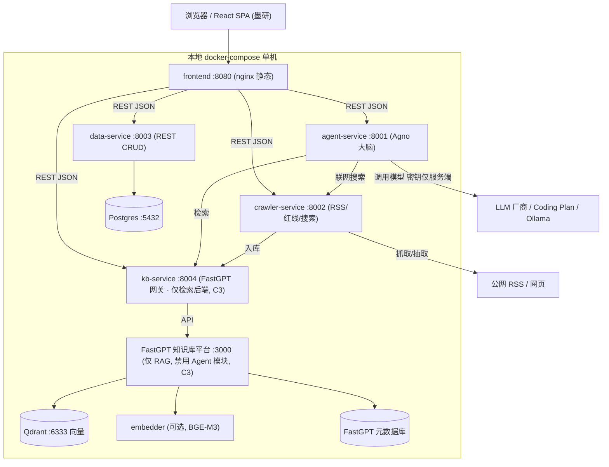
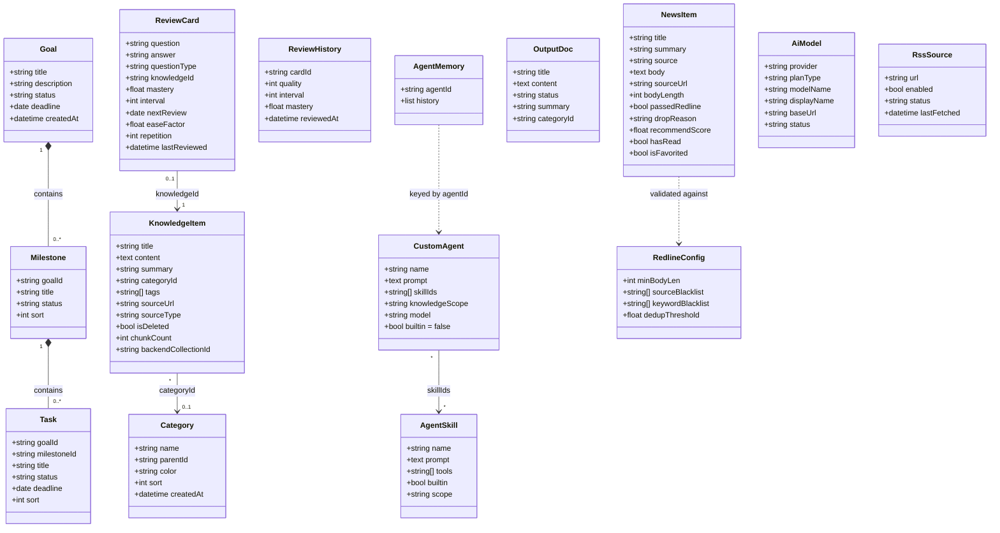
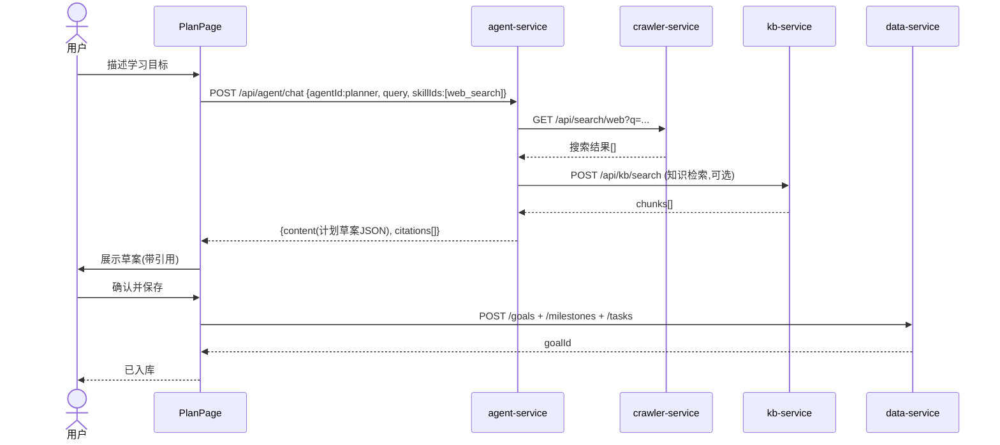
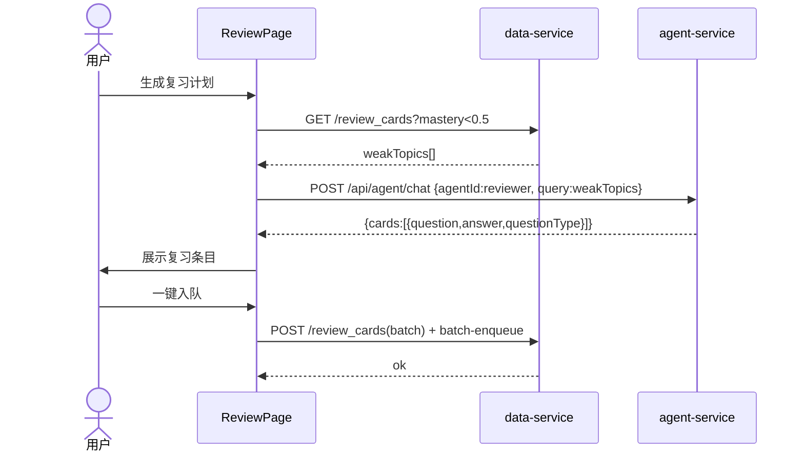
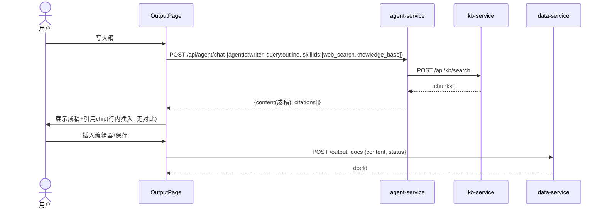
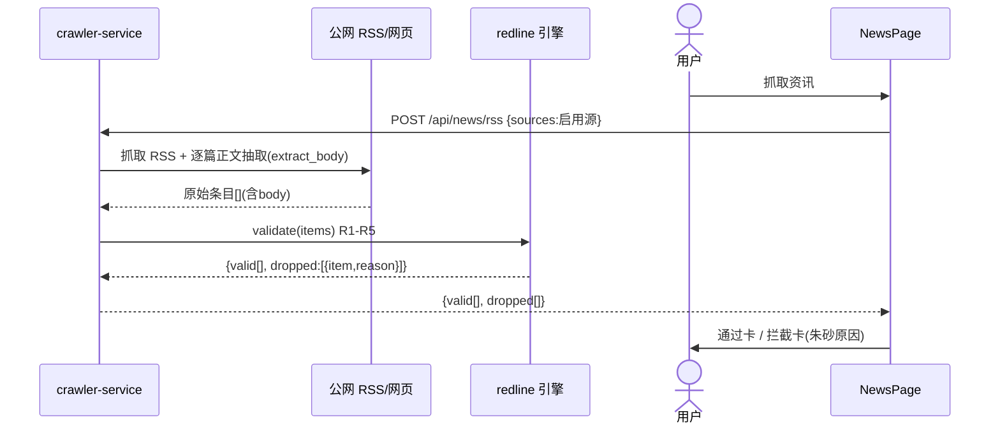
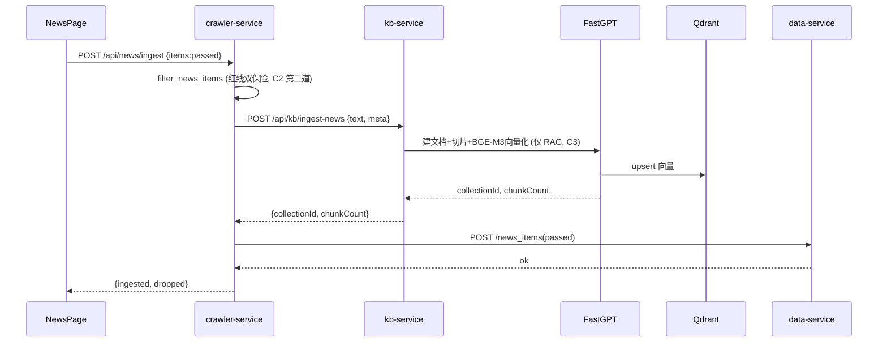
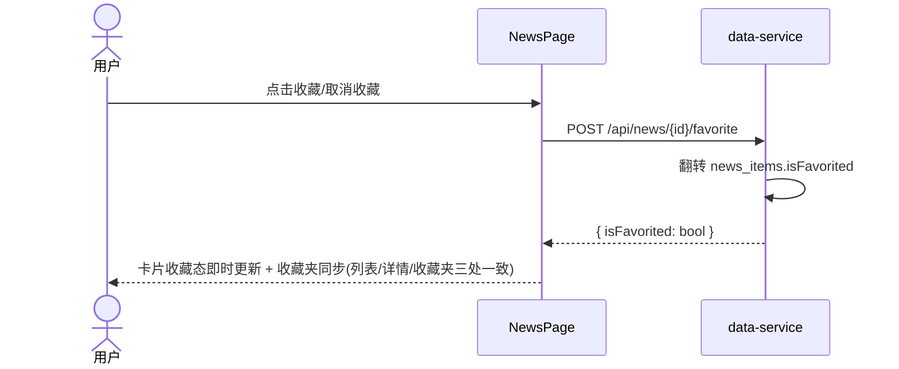
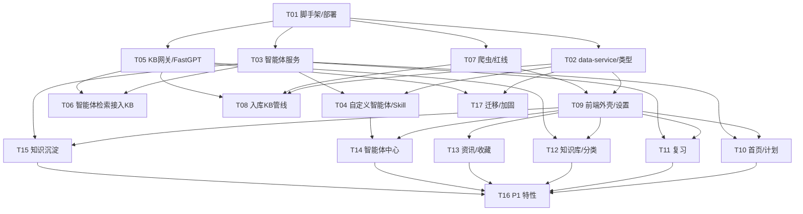

# StudyMind V2.0 架构设计文档（Architecture）

> 文档版本：**V2.0-Architecture v1.0**
> 日期：2026-07-11
> 作者：架构师 高见远（Gao / Bob）
> 关联 PRD：`StudyMind_V2.0_PRD_v1.0.md`（产品经理 许清楚，V2.0-PRD v1.0）
> 关联原型：`StudyMind_V2.0_Prototype_v1.0.html`（huashu-design 墨研高保真原型）
> 配套评审：`StudyMind_V2.0_Architecture_Review.md`（架构评审结论，C3 / §2.4 缺口已落定）
> 性质：**设计文档**，确认后进入开发（用户明确要求"先 PRD + 架构，确认后再开发"）
> 语言：中文（与 PRD 一致）
> 版本策略：本 v1.0 在既有架构草稿（§0–§11 + 附录）基础上**补全完善**——落实评审 C3 硬约束、修正 `NewsItem.isFavorited`、落地 PRD §2.4「基础功能保留清单 13 项」、对齐 V1.x 四个统计聚合接口与 PRD §6 接口契约；非从零重写。

---

## 0. 关键选型速览（落定结论）

| # | 决策点 | 默认选型 | 备选 | 一句话理由 |
|---|--------|----------|------|-----------|
| 1 | 前端框架 | **React + Vite + TypeScript** | Vue3 | 配合墨研原型、AI 编码友好、组件化彻底、生态（TipTap/React-Query）成熟 |
| 2 | 智能体底座 | **Agno（自托管 Python 框架）** 包裹 V1.x 领域逻辑 | LangGraph（更重）、Dify Agent（耦合平台） | 轻量 MIT、纯 Python 自托管、内置 Agent/Tool/Memory/Session，满足"集成开源底座 + 自定义 Skill"且不绑云 |
| 3 | 知识库平台 | **FastGPT（社区版自托管）** | Dify（更重）、自建 RAG | 中文 RAG 最优、混合检索+RRF 重排、4C8G、低运维、15 分钟 docker 起 |
| 4 | 向量模型/库 | **BGE-M3**（默认）+ **Qdrant**（生产）/ **ChromaDB**（开发） | Qwen3-Embedding-8B（中文最佳，需 GPU） | BGE-M3（MIT，1024 维，稠密+稀疏+多向量，100+ 语言）性价比最高；Qdrant 生产过滤扩展优 |
| 5 | 模型配置存储 | **迁 data-service（Postgres，替代 CloudBase 本地）**；密钥仅服务端 | 保留 CloudBase 适配器 | 多端同步 + 密钥不落浏览器；本地自托管去除云厂商绑定 |
| 6 | 本地化部署 | **docker-compose 单机**，数据底座可插拔（本地 Postgres / 云 CloudBase） | k8s | 用户明确"腾讯云太难"，docker-compose 优先 |
| 7 | 编辑器 | **TipTap（ProseMirror）** | ProseMirror 裸写 | 单一写作面、行内插入、AI 侧栏面板，取消 V1.x 对比模式 |
| 8 | 数据底座 | **data-service（FastAPI+Postgres）** 为默认；**CloudBase 适配器**保留 | Supabase 自托管 | 复用 V1.x 集合结构，去云绑定，逻辑显式可控 |

**三条硬约束已落定（C1 / C2 / C3）：**
- **C1 禁止前端写死 mock**：所有页面走真实接口/服务；未配置服务时显示"引导空态"而非假列表（见 §7、§10）。
- **C2 禁止爬取无正文资讯**：红线仅在服务端（crawler-service）执行；前端无绕过入口；入库前二次校验（见 §7、§10）。
- **C3 禁用 FastGPT Agent 应用模块**（评审落定）：FastGPT 仅作无状态知识库检索后端（经 kb-service `/api/kb/*`），不得启用其 Agent 应用 / 技能(插件) / 多轮记忆编排；所有智能体编排、记忆、工具、密钥统一收敛于 agent-service（Agno）。详见 §2.3 末尾与 §7。

---

## 1. 架构总览

StudyMind V2.0 是一个**本地优先、自托管**的 AI 学习管理系统。系统由一个 React 前端 + 一组解耦的后端服务组成，核心是把"AI 智能体"抽成独立大脑（agent-service），把"知识库"抽成可插拔平台（FastGPT，经 kb-service 网关调用），把"资讯爬虫 + 红线"抽成独立 crawler-service，把所有业务数据 CRUD 收口到 data-service（默认本地 Postgres，可选 CloudBase 适配器）。前端零 mock，所有能力通过统一 API 客户端调用真实服务。

> **V2.0 重写边界声明（关键）**：V2.0 **全量重写前端**（V1.x 为原生 JS SPA，无组件模型，不值得增量），但**必须平移 PRD §2.4「基础功能保留清单」列出的 13 项 V1.x 基础功能**——分类管理 / 知识条目 / 复习卡+SM-2 / 学习计划 / 出题(choice·fill·qa) / 资讯浏览+已读 / 资讯收藏 / 首页统计 / 模型配置 / 工程约束 / 两条链路（知识条目→复习卡、资讯入库知识库）/ RSS 源管理。这 13 项在 V2.0 为**非变更基线**，仅允许实现层重构（CloudBase→data-service、原生 JS→React、直管→网关），**不得因"全量重写"而删减或重设计**。详见 §8 保留清单→任务映射表。
>
> **首页统计聚合接口基线**：data-service 的聚合接口须**沿用 V1.x 四个统计函数**——`getStudyHeatmap` / `getTodayReviewStats` / `getWeakTopics` / `getPlanStats`（对应 PRD §2.4 #8 / V2-HOME-001 基线）。视觉升级不得移除任一统计维度（见 §3.2）。

**部署拓扑 / 分层图（Mermaid）：**



分层说明：
- **展现层**：React SPA（墨研设计语言），仅持有 UI 状态与服务调用，不持有业务密钥。
- **服务层**：agent-service（大脑）、crawler-service（资讯/搜索）、kb-service（知识库网关）、data-service（数据 CRUD）。各服务职责单一、可独立部署/替换。
- **基础设施层**：FastGPT（知识库平台，**仅检索，C3**）、Qdrant（向量）、Postgres（业务数据）、embedder（BGE-M3，可选容器）、LLM 厂商（经 agent-service 服务端调用）。

---

## 2. 实现方案与框架选型（逐项落实 8 大决策 + 保留清单）

### 2.1 前端框架（决策 1）
**默认：React + Vite + TypeScript。**

- **理由**
  - huashu-design 原型为 HTML/CSS，易映射为 React 组件（结构 + 样式 token 直接搬）。
  - AI 编码（含本团队 Agent）对 React + TS 的生成质量显著高于原生 JS / Vue，符合"AI 开发友好"诉求。
  - 组件化彻底，便于落实 C1（每组件数据来自真实 hook，无 `const mockData`）。
  - 生态成熟：TipTap（编辑器）、@tanstack/react-query（服务端状态）、zustand（UI 状态）、recharts（热力图/图表）。
- **设计系统**：不引入 MUI 默认主题（会与"墨研"冲突）。自建轻量设计 token（`theme/ink-scholar.ts` + Tailwind 变量）：暖纸 `#F6F3EC`、表面 `#FFFFFF`、墨色 `#211C16`、发丝线 `#E4DDD0`、竹青绿 `#2F6B4F`、琥珀 `#C8772E`、朱砂 `#B23A2E`；标题衬线（Noto Serif SC / Newsreader），正文 Noto Sans SC。图标用细线 SVG（自绘或 lucide-react 单色线型），**不用 emoji 当图标**。
- **状态管理**：服务端状态用 React-Query（自动缓存/重试/失败态）；UI 状态（侧栏选中、对话 session）用 zustand。
- **迁移策略（是否全量重写）**：**全量重写前端**（V1.x 为原生 JS SPA，无组件模型，不值得增量）。但**保留 V1.x 模块边界、CloudBase 集合结构，以及 PRD §2.4「基础功能保留清单」13 项**——即 8 个模块页面 + 相同的集合字段（goal/milestone/task/review_card/knowledge_item/category/news_item/output_doc）+ 13 项基础功能，**仅把 `db.js` 换成语 typisierte `services/dataService.ts` + React-Query hooks，并重写实现层**。保留清单功能（分类管理、知识条目、复习卡+SM-2、学习计划、基础出题、资讯浏览/已读、收藏、首页统计、模型配置、工程约束、两链路、RSS）一律平移，不得因"重新设计"而删减。**不保留 V1.x 文件**，旧代码归档到 `archive/v1/`。
- **构建产物**：`npm run build` → `dist/`，由 nginx 静态托管，可 docker 部署。

### 2.2 智能体底座（决策 2，调和"集成开源"与"演进 V1.x"）
**默认：Agno（原 Phidata，MIT，纯 Python）作为智能体底座，包裹并演进 V1.x 的 5 个内置智能体、记忆隔离、引用生成逻辑。**

- **为什么不是纯自研 / 为什么不是 Dify/LangGraph**
  - *纯自研*：违背"能集成的就不造轮子"，编排/记忆/工具抽象要重造。
  - *LangGraph*：能力强但偏"图编译"心智，对我们的"单智能体 + 工具 + 记忆"场景偏重，样板多。
  - *Dify Agent*：会把智能体绑死在 Dify 平台（重部署 ~8C16G），而我们已选 FastGPT 做知识库，再引入 Dify 会造成两个重平台并存、运维翻倍。
  - *Agno*：轻量（pip 安装）、自托管、内置 Agent / Tool / Memory / Session / Knowledge，MIT；天然支持"运行时按 prompt + 工具白名单创建智能体"——正好对应"用户自定义智能体 + 自定义 Skill"。**它是'底座'而非'平台'，不抢知识库/前端的职责。**
- **如何演进 V1.x**：
  - V1.x 的 `AGENTS`（5 个内置）、`generate_with_citations`（检索→拼装→调用→引用）、`AgentMemory`（按 agent_id 隔离）**平移为 Agno 的 Instruction + Tool + Session/Memory 实现**。
  - 自定义智能体 = 运行时用用户 prompt + 绑定 Skill（工具白名单）创建一个 Agno Agent；自定义 Skill = 一段 prompt + 允许的工具集合，落库为 `agent_skills`，运行时装配为 Agno Tool。
  - 记忆隔离：**严格按 `agent_id` 维度**（沿用 V1.x 约束），跨智能体不可见。
- **工具（Tool）清单**：
  - `web_search`：调用 crawler-service `/api/search/web`（服务端抓取，带 SSRF 防护，沿用 V1.x `_validate_outbound_url`）。
  - `knowledge_base`：调用 kb-service `/api/kb/search`（FastGPT 混合检索 + RRF 重排）。
  - `code_exec`：**P2**。默认禁用；启用时用隔离沙箱（Docker 容器 / nsjail + 超时），仅放行白名单语言，绝不触网。
- **智能体服务如何被计划/复习/沉淀调用（接口网关）**：
  - 学习计划：前端调 `agent-service POST /api/agent/chat {agentId:planner, skillIds:[web_search]}` → 返回计划草案 JSON + citations → 前端确认后写 data-service。
  - 复习计划：前端调 `agent-service POST /api/agent/chat {agentId:reviewer}`（携带薄弱主题）→ 返回复习条目 → 写 data-service `review_cards` + 入队。
  - 知识沉淀：前端调 `agent-service POST /api/agent/chat {agentId:writer, skillIds:[web_search, knowledge_base]}` → 返回成稿 + citations → 行内插入编辑器。
  - 即：**所有 AI 调用汇聚到 agent-service 一个入口**，模块间不直接调 LLM。

### 2.3 知识库平台（决策 3）
**默认：FastGPT（社区版，自托管）。**

- **理由**：中文优化 RAG、混合检索 + RRF 重排、~89% 准确率、docker 15 分钟起、4C8G、运维低；其"知识库/文档/分块"模型正好对应我们的"上传→切片→向量化→检索"。
- **备选 Dify**：工作流/Agent 更强但更重（~8C16G），且与 FastGPT 定位重叠；若用户已重度使用 Dify 可切换（kb-service 做适配器即可）。
- **许可证提示**：FastGPT 社区版对个人/学习自托管免费，商用需关注其 License 条款；若有顾虑，kb-service 可直接改为"自建 RAG（LangChain + Qdrant + BGE-M3）"适配器，前端无感。
- **职责切分**：FastGPT 负责 解析/切片/向量化/检索/重排；我们**不自己维护向量与切片**（落定"不造轮子"）。知识条目的**元数据**仍存 data-service（`knowledge_items`），**向量与切片**由 FastGPT 管理（kb-service 持有 collection_id 映射）。
- **编排 / 记忆 / 工具 / 密钥统一收敛于 agent-service（Agno），FastGPT 不持有任何编排职责。**
- **C3 · 禁用 FastGPT Agent 应用模块（硬约束）**：FastGPT 仅用作**无状态知识库检索后端**（经 kb-service `/api/kb/*`），**不得启用其 Agent 应用 / 技能(插件) / 多轮记忆编排**。所有智能体编排、记忆、工具、密钥统一收敛于 agent-service（Agno），避免双记忆 / 双编排 / 密钥分散（风险 R-1~R-8，见评审）。kb-service 仅调用 FastGPT 的"数据集/知识库/检索" API，**不调用其 Agent / Workflow / 应用端点**。详见 §7 C3。

### 2.4 向量模型与向量库（决策 4）
- **向量模型默认 BGE-M3**（BAAI, MIT, 1024 维, 稠密+稀疏+多向量, 100+ 语言, 中文优化）。通过 FastGPT 的 embedding 配置接入；小规模可 CPU（embedder 可选容器用 `sentence-transformers` 或 Ollama 拉 `bge-m3`）。
- **备选 Qwen3-Embedding-8B**（Apache 系, ~119 语言, 中文最佳，但 8B 需 GPU）——留给对中文检索精度极致要求的用户。
- **向量库**：开发用 **ChromaDB**（简单）；生产用 **Qdrant**（过滤/扩展优，FastGPT 支持对接）。**注意**：选用 FastGPT 后，向量库实际由 FastGPT 持有（FastGPT 后端连 Qdrant/Milvus），我们不在应用层直连向量库——kb-service 是唯一的向量访问面。
- **迁移脚本思路（V1.x → V2.0）**：见 §8 T17。核心：V1.x 用 all-MiniLM 的切片因模型更换**必须重建**（无法无损迁移向量）。脚本 = 导出 `knowledge_items` 文本 → 用 BGE-M3 重新切片/向量化（经 FastGPT 上传接口）→ 写回 `backend_collection_id` 映射；旧 ChromaDB 数据可丢弃。

### 2.5 模型配置存储（决策 5）
- **迁 data-service**（默认本地 Postgres；CloudBase 适配器保留）。集合 `ai_models` 存 `{provider, planType, modelName, displayName, baseUrl, status}`；`app_settings` 存默认模型/温度/预算等。
- **密钥仅服务端**：API Key **不落浏览器**。设置页把配置（含 key）提交到 data-service；data-service 将 key 存入仅后端可读的 secret 集合（`model_secrets`，GET 列表时不返回明文）。**agent-service 是唯一的 LLM 调用方**，服务端读取 `ai_models` + `model_secrets` 用对应 key 调厂商。
- **收益**：多端同步（同一 data-service）、密钥不暴露、满足 C1（前端零密钥）。
- **本地自托管折中**：若完全离线无 data-service，agent-service 也支持从自身 `.env`（docker secret）读 `MODEL_<id>_KEY` 作为兜底。

### 2.6 本地化部署拓扑（决策 6）
**docker-compose 单机清单**（端口/数据卷/启动见 `deploy/docker-compose.yml` 与 `.env.example`）：

| 服务 | 镜像/构建 | 端口 | 数据卷 | 职责 |
|------|-----------|------|--------|------|
| `frontend` | nginx:alpine + 构建产物 | 8080 | `./web/dist` 挂载 | 静态 SPA |
| `agent-service` | 本地构建（Python+Agno） | 8001 | `./services/agent-service` | AI 大脑 / 自定义智能体·Skill（唯一编排/记忆/工具/密钥方，C3） |
| `crawler-service` | 本地构建（Python） | 8002 | `./services/crawler-service` | RSS 抓取/正文抽取/红线/联网搜索 |
| `kb-service` | 本地构建（Python） | 8004 | `./services/kb-service` | FastGPT 网关（上传/检索/入库，**仅检索后端，C3）** |
| `data-service` | 本地构建（Python+FastAPI） | 8003 | `./services/data-service` | 全部 CRUD（替代 CloudBase）+ 聚合统计 + 收藏/已读状态 |
| `postgres` | postgres:16 | 5432 | `pgdata:/var/lib/postgresql/data` | data-service 存储 |
| `fastgpt` | fastgpt 镜像（社区版） | 3000 | 配置卷 | 知识库平台（**仅 RAG，禁用 Agent 模块，C3）** |
| `fastgpt-db` | mongo/redis/pg（按 FastGPT 官方 compose） | 内部 | 内部卷 | FastGPT 元数据 |
| `qdrant` | qdrant/qdrant:latest | 6333 | `qdrant_data:/qdrant/storage` | 向量库（FastGPT 后端） |
| `embedder`（可选） | sentence-transformers / ollama | 内部 | — | BGE-M3 向量化（小规模 CPU 可省，用 FastGPT 内置） |

**启动方式**：`cp deploy/.env.example deploy/.env && docker compose -f deploy/docker-compose.yml up -d`；前端访问 `http://localhost:8080`。各服务均暴露 `/health`。

**数据底座可插拔（去云绑定关键）**：`data-service` 默认连本地 Postgres；通过环境变量 `DATA_BACKEND=cloudbase` 可切换为 CloudBase 适配器（复用 V1.x 集合），前端无感。满足"避免强绑定云厂商"。

---

## 3. 服务边界与接口契约

> 统一响应信封：`{ code: 0, data: <T>, message: "ok" }`；`code != 0` 为错误（见 §10 错误码）。所有时间字段 ISO-8601 UTC。超时单请求 ≤45s。
> 本节能覆盖 PRD §6 各模块接口雏形，并显式对齐 PRD 新增项：自定义智能体/Skill（§3.1）、收藏接口（§3.2 ` /api/news/favorites` + 切换）、分类 `/api/db/categories`（§3.2）、知识沉淀单面编辑器（取消对比，见 §3.5 / 类图 `OutputDoc`）、红线 `validate`/`ingest` 双保险（§3.3）。

### 3.1 智能体服务 agent-service `:8001`（核心大脑 · 唯一编排/记忆/工具/密钥方，C3）
```
POST /api/agent/chat
  body: { agentId: string, query: string, model?: string,
          skillIds?: string[], sessionId?: string }
  resp: { agentId, content, citations: [{title, source_doc_id, snippet}],
          contextCount, sessionId }

GET  /api/agent/list
  resp: { data: [{ id, name, builtin, desc, skillIds: [] }] }   // 内置5 + 自定义

POST /api/agent            // 自定义智能体 (V2-AGENT-002)
  body: { name, prompt, skillIds: [], knowledgeScope?, model? }
  resp: { id }

DELETE /api/agent/{id}     // 级联清理记忆 (V2-AGENT-002 AC3)

GET  /api/agent/{id}/memory
  resp: { agentId, history: [{role, content, ts}] }   // 记忆隔离查看

POST /api/skill            // 自定义 Skill (V2-AGENT-003)
  body: { name, prompt, tools: ['web_search'|'knowledge_base'|'code_exec'] }
  resp: { id }

DELETE /api/skill/{id}
```
- 内置智能体（常量，沿用 V1.x）：`planner`(学习规划师)、`tutor`(知识讲解员)、`coach`(出题教练)、`reviewer`(复习助手)、`writer`(写作助手)。
- 内置 Skill：`web_search_full`、`outline_gen`、`article_refine`、`review_plan_gen`、`material_reco`。
- 引用（citations）：来自知识库检索切片，与 LLM 输出解耦，确保"引用可用"可判定；无引用显式说明。
- **C3 边界**：agent-service 不调用 FastGPT 的 Agent/Workflow 端点；FastGPT 仅经 kb-service 提供检索能力。

### 3.2 数据服务 data-service `:8003`（替代 CloudBase 的 CRUD + 聚合 + 收藏/已读状态）
集合级 REST（路径前缀 `/api/db`）：
```
GET/POST   /api/db/goals
GET/PUT/DEL /api/db/goals/{id}
GET/POST   /api/db/goals/{id}/milestones
GET/POST   /api/db/goals/{id}/tasks
GET/POST   /api/db/review_cards
POST /api/db/review_cards/batch-enqueue   body:{ids[]}
GET/POST   /api/db/review_history
GET/POST   /api/db/knowledge_items
GET/POST/PUT/DEL /api/db/categories        # 分类管理 (V2-SET-003 保留清单#1)
GET/POST   /api/db/news_items
GET/PUT/DEL /api/db/news_items/{id}        # 更新 hasRead / isFavorited 等状态字段
GET/POST   /api/db/output_docs
GET/POST/DEL /api/db/agent_skills
GET/POST/DEL /api/db/agents                // 自定义智能体元数据
GET/PUT   /api/db/ai_models
POST/DEL  /api/db/model_secrets             // 密钥仅后端读
GET/PUT   /api/db/app_settings
GET/POST/PUT/DEL /api/db/rss_sources
GET/PUT   /api/db/redline_config
```
- **首页/统计聚合接口（沿用 V1.x 四个统计函数，对应 PRD §2.4 #8 / V2-HOME-001 基线；视觉升级不得移除任一统计维度）**：
  ```
  GET /api/db/stats/heatmap       # <- V1.x getStudyHeatmap()    12 周学习热力图
  GET /api/db/stats/today-review  # <- V1.x getTodayReviewStats() 今日待复习数
  GET /api/db/stats/weak-topics   # <- V1.x getWeakTopics()      薄弱主题(mastery<阈值)
  GET /api/db/stats/plan          # <- V1.x getPlanStats()       计划进度统计
  ```
- **资讯收藏 / 已读（V2-NEWS-004，保留清单 #7）**：`news_items` 状态由 data-service 持有。PRD §6.3 约定路径与内部实现等价映射如下（nginx 将 `/api/news/favorites`、`/api/news/{id}/favorite` 路由到 data-service）：
  ```
  GET  /api/news/favorites          # 收藏列表, 等价 /api/db/news_items?isFavorited=true
    resp: { data: [{ ...news_items, isFavorited: true }] }
  POST /api/news/{id}/favorite      # 收藏/取消切换 (V2-NEWS-004 AC2)
    resp: { success, data: { isFavorited: bool } }
  ```
- SM-2 算法保留在服务端（data-service），与 V1.x `_sm2` 一致；V2-REVIEW-005 仅在其上增加可切换 FSRS 项，不得移除 SM-2 本体（保留清单 #3）。

### 3.3 爬虫服务 crawler-service `:8002`（RSS/红线/搜索）
```
POST /api/news/rss        body:{ sources: string[] }   // 仅启用源；逐篇正文抽取
  resp: { valid: NewsItem[], dropped: [{item, reason}], failedSources: [] }

POST /api/news/extract    body:{ url: string }
  resp: { success, title, summary, source, body, content, url, length }

POST /api/news/validate   body:{ items: [{title,summary,source,body,sourceUrl}] }
  resp: { valid: [], dropped: [{item, reason}] }       // 红线 R1-R5 服务端执行 (C2 第一道)

POST /api/news/ingest     body:{ items: [], categoryId? }
  resp: { ingested, dropped_count, dropped:[], items:[] }  // 红线双保险(第二道)→kb-service (C2)

POST /api/search/web      body:{ query: string, top_k? }
  resp: { data: SearchResult[] }                        // Bing，SSRF 防护

GET  /api/rss/sources     resp:{ data: [{id,url,enabled,status,lastFetched}] }
POST /api/rss/sources     body:{ url }                  // 校验可达后入库
PUT  /api/rss/sources/{id} body:{ enabled?, url? }
DEL  /api/rss/sources/{id}
```
- 红线引擎 `redline.validate`：R1 无正文(body 空或 <minBodyLen 默认 200)、R2 来源黑名单、R3 关键词红线、R4 仅摘要无正文(视为 R1)、R5 去重(同 URL/标题相似≥85% 跳过)。阈值/名单在 `redline_config` 可配（设置页 UI）。
- C2：红线**只在服务端**；前端无绕过入口，只展示通过与拦截结果。
- **双保险**：`/api/news/validate`（第一道，入库前校验）与 `/api/news/ingest` 内部 `filter_news_items`（第二道）共同拦截无正文/黑名单条目，确保"无正文不入库、不推荐"。

### 3.4 知识库网关 kb-service `:8004`（封装 FastGPT · 仅检索后端，C3）
```
POST /api/kb/upload       body:{ file | text, title, categoryId? }
  resp: { collectionId, chunkCount, status }

POST /api/kb/search       body:{ query, topK?, categoryId? }
  resp: { chunks: [{content, title, source_doc_id, score}], count }

POST /api/kb/ingest-news  body:{ text, title, meta? }   // crawler 调用
  resp: { collectionId, chunkCount }

GET  /api/kb/chunks/{collectionId}
DEL  /api/kb/{collectionId}
```
- **C3 硬性边界**：kb-service 仅调用 FastGPT 的"数据集 / 知识库 / 检索" API，**FastGPT 仅以 API 形式提供检索能力，不调用其 Agent / Workflow / 应用端点**。所有智能体编排、记忆、工具、密钥统一在 agent-service（Agno），FastGPT 不持有任何编排职责。
- kb-service 是 FastGPT API 的**唯一适配面**；切 Dify/自建 RAG 只改这里，agent-service 与 crawler-service 无感。

### 3.5 模块编排（前端侧，非独立后端）
学习计划/复习计划/知识沉淀的"服务"是**前端编排**：调 agent-service 生成 → 调 data-service 落库。无需新增后端容器（与 V1.x `db.js` 编排逻辑一致，仅搬为前端 hooks）。
- **知识沉淀单面编辑器（取消对比）**：V2-OUTPUT-001/002，前端 `OutputPage` 用单一 TipTap 写作面（见 §5 `OutputDoc`、§4 文件结构 `editor/*`），AI 能力以侧栏面板 + 行内插入呈现；写 `output_docs`，不再有"用户 vs AI 对比"布局。
- **两链路（保留清单 #11 / #12）**：① 知识条目→复习卡（`POST /api/review/from-knowledge`，关联 knowledgeId，基线链路保留）；② 资讯入库知识库（crawler → kb-service → FastGPT，链路保留，见 §6 时序⑤）。

---

## 4. 文件列表及相对路径（V2.0 新仓库结构）

```
StudyMind-V2/
├── deploy/                         # 本地部署
│   ├── docker-compose.yml
│   ├── .env.example
│   ├── nginx/frontend.conf
│   ├── fastgpt/                    # FastGPT 官方 compose 引入 + 配置(C3: 仅启用知识库/检索, 关闭 Agent 应用)
│   └── qdrant/config.yaml
├── web/                            # 前端 (React+Vite+TS)
│   ├── index.html  package.json  vite.config.ts  tsconfig.json
│   ├── tailwind.config.ts  postcss.config.js
│   └── src/
│       ├── main.tsx  App.tsx  router.tsx
│       ├── theme/ink-scholar.ts  theme/globals.css
│       ├── components/            # Button/Card/Sidebar/Topbar/Toggle/Modal/EmptyState...
│       ├── pages/                 # Home/Plan/News/Knowledge/AgentCenter/Review/Output/Settings
│       ├── features/              # plan/ review/ output/ news/ agent/ knowledge/ settings (hooks+逻辑)
│       │                           #   - news 含收藏 toggle (V2-NEWS-004) / 已读
│       │                           #   - knowledge 含分类管理 (V2-SET-003)
│       │                           #   - review 含 SM-2 评分 / choice·fill·qa 基础出题 (V2-REVIEW-001/002)
│       │                           #   - plan 含 confirmCreateGoalFromPlan (保留清单#4)
│       │                           #   - home 复用四聚合接口 (保留清单#8)
│       ├── services/              # apiClient / agentService / crawlerService / kbService / dataService / settingsService
│       ├── types/                 # 共享 TS 类型（与 data-service schema 对齐, 含 NewsItem.isFavorited）
│       ├── store/                 # zustand: ui / agentSession
│       ├── hooks/                 # react-query hooks: useGoals/useReviewQueue/useNewsFavorites/...
│       └── lib/                   # utils / mockGuard(断言无 mock) / constants
├── services/                       # 后端服务（各自 Dockerfile + requirements.txt）
│   ├── agent-service/
│   │   ├── app/main.py  app/config.py
│   │   ├── app/agents.py          # Agno 装配 + 内置智能体 + 自定义加载
│   │   ├── app/skills.py          # 内置/自定义 Skill → Agno Tool
│   │   ├── app/memory.py          # 按 agent_id 隔离的会话记忆
│   │   ├── app/tools/{web_search,knowledge_base,code_exec}.py
│   │   └── app/routes/{agent,skill}.py
│   ├── crawler-service/
│   │   ├── app/main.py  app/config.py
│   │   ├── app/{rss,extract,redline,web_search}.py
│   │   └── app/routes/{news,rss}.py
│   ├── kb-service/
│   │   ├── app/main.py  app/config.py
│   │   ├── app/fastgpt_client.py  # FastGPT API 适配(仅检索端点, C3)
│   │   └── app/routes/kb.py
│   ├── data-service/
│   │   ├── app/main.py  app/config.py
│   │   ├── app/db.py               # Postgres(异步) + CloudBase 适配器
│   │   ├── app/models.py           # ORM 表(映射 V1.x 集合, 含 categories/news_items.isFavorited)
│   │   ├── app/schemas.py          # pydantic
│   │   ├── app/stats.py            # 四聚合: heatmap/today-review/weak-topics/plan (V1.x 函数平移)
│   │   └── app/routes/{goals,review,knowledge,news,agent,settings,rss,stats}.py
│   └── shared/schemas/            # 跨服务共享 OpenAPI/pydantic 片段(可选)
├── archive/v1/                     # V1.x 旧代码归档(不再修改)
├── v2_prd/                         # 设计文档与原型同目录
│   ├── StudyMind_V2.0_PRD_v1.0.md
│   ├── StudyMind_V2.0_Architecture_v1.0.md   # 本文件
│   ├── StudyMind_V2.0_Architecture_Review.md
│   ├── class-diagram.mermaid
│   ├── sequence-diagram.mermaid
│   └── StudyMind_V2.0_Prototype_v1.0.html
└── README.md
```

---

## 5. 数据结构与接口（类图 / ER 示意）

> 业务实体存 data-service（Postgres，等价于 V1.x CloudBase 集合）；知识向量/切片由 FastGPT 管理（kb-service 持有 `collection_id` 映射，不在下图展开）。
> 与 PRD §2.4 保留清单对齐说明：`Category` 补 `createdAt`（对齐 V1.x `_id/name/parentId?/sort/createdAt`）；`NewsItem` 补 `isFavorited:bool`（V2-NEWS-004，保留清单 #7）；`ReviewCard`/`Goal` 保留 V1.x SM-2 字段（保留清单 #3）与计划字段（保留清单 #4）。



---

## 6. 程序调用流程（关键链路时序图）

完整 Mermaid 见 `./sequence-diagram.mermaid`（含 ① 计划生成 / ② 复习生成 / ③ 知识沉淀 / ④ 红线拦截 / ⑤ 资讯入库 / ⑥ 资讯收藏切换）。以下为 6 条核心链路：

### ① 学习计划由智能体生成


### ② 复习计划由智能体生成（SM-2 基线保留）


### ③ 知识沉淀 大纲→成稿（单面编辑器）


### ④ 资讯爬取红线拦截（C2 服务端执行）

> 无正文条目在 `validate` 即丢弃，前端无绕过入口（C2）。

### ⑤ 资讯入库知识库（红线双保险，保留清单 #12）


### ⑥ 资讯收藏切换（V2-NEWS-004，保留清单 #7）


---

## 7. 约束与红线

- **C1 禁止前端写死 mock**：所有页面数据来自真实接口/服务（data-service / agent-service / kb-service / crawler-service）。未配置服务时显示"引导空态"（如"未配置模型，请到设置添加"），**不得用假列表填充**。构建期/Code Review 拦截 `const mock`、硬编码示例数组（见 §10 mockGuard）。
- **C2 禁止爬取无正文资讯**：红线仅在 crawler-service 服务端执行（R1-R5）；前端无绕过入口；入库前 `filter_news_items` 二次校验（双保险）。无正文一律不入库、不推荐。
- **C3 禁用 FastGPT Agent 应用模块（硬约束，评审落定）**：
  - FastGPT **仅用作无状态知识库检索后端**，经 kb-service `/api/kb/*` 提供"数据集 / 知识库 / 检索"能力。
  - **不得启用** FastGPT 的 Agent 应用 / 技能(插件) / 多轮记忆编排。
  - 所有智能体**编排、记忆、工具、密钥统一收敛于 agent-service（Agno）**，避免双记忆 / 双编排 / 密钥分散。
  - 违反 C3 的典型后果（风险 R-1~R-8）：
    - R-1 双记忆不一致（Agno 与 FastGPT 各存对话，引用错乱）
    - R-2 引用归属混乱（两套 citation 体系，前端无法统一溯源）
    - R-3 密钥分散（FastGPT 自带模型接入，违背"密钥仅 agent-service"）
    - R-4 工具/Skill 分裂（自定义 Skill 无法两侧复用）
    - R-5 记忆隔离粒度不符（FastGPT 按应用+会话隔离，无法保证 agent_id 级隔离）
    - R-6 平台绑定加深（违背"可插拔知识库"，退出成本剧增）
    - R-7 社区版限制（并发/应用数受限，智能体并发受损）
    - R-8 可观测性下降（`trace_id`/`agent_id` 链路断裂）
  - 落地校验：kb-service 仅调用 FastGPT 检索类端点；FastGPT 部署配置关闭 Agent 应用能力；Code Review 拦截对 FastGPT Agent/Workflow 端点的调用。
- 智能体对话超时 ≤45s，超时不重试（防烧 token，前端 AbortController + 后端 httpx timeout）。
- 记忆严格按 `agent_id` 隔离，跨智能体不可见。
- 所有 AI 回答尽量带可溯源引用（citations）；无引用显式说明。
- 前端零密钥：API Key 仅服务端（agent-service 调厂商 / data-service `model_secrets`）。
- 出站抓取 SSRF 防护沿用 V1.x（仅 https + 目标 IP 非私网/保留地址）。

---

## 8. 任务列表（有序、含依赖、按实现顺序——后续开发直接依据）

> 按 **5 个阶段（Phase）** 组织，阶段内任务可并行派工；每个任务标注涉及文件、依赖、优先级（P0=首发 MVP / P1=增强）。
> 设计原则：每任务覆盖 ≥3 个相关文件，避免单文件微任务；T01 为基础设施（满足"第一个任务必须是项目基础设施"）。
> **保留清单对齐**：下表确认 PRD §2.4「13 项基础功能保留清单」在 V2.0 均有对应实现任务，全量重写时不得遗漏（处置定义见 PRD §2.4）。

### 保留清单 → 任务映射（非变更基线，全量重写须平移）
| # | 保留功能 | 对应需求 | 实现任务 | 处置 |
|---|----------|----------|----------|------|
| 1 | 分类管理（Categories） | V2-SET-003 | T02(后端) + T12(前端) | 重构保留（CloudBase→data-service `/api/db/categories`） |
| 2 | 知识条目 CRUD + 入库 | V2-KB-001 | T02 + T05 + T12 | 重构保留（元数据→data-service，向量→FastGPT 经 kb-service） |
| 3 | 复习卡 + SM-2 间隔重复 | V2-REVIEW-001（AC3 基线） | T11（SM-2 完全保留） | SM-2 完全保留（服务端 `_sm2`）；卡片管理重构保留 |
| 4 | 学习计划（目标/里程碑/任务） | V2-PLAN-001 | T10 | 完全保留（`confirmCreateGoalFromPlan` 平移） |
| 5 | 出题（choice/fill/qa 基础题型） | V2-REVIEW-002（AC0 基线） | T11 | 完全保留（三题型 P0 基线，难度自适应 P1 增强） |
| 6 | 资讯浏览 / 已读 | V2-NEWS-001/002/003 | T13 | 完全保留（`hasRead` 状态） |
| 7 | 资讯**收藏** | V2-NEWS-004 | T02(后端) + T13(前端) | 完全保留（`isFavorited`，`/api/news/favorites` + 切换） |
| 8 | 首页统计（四聚合接口） | V2-HOME-001（基线） | T10（复用四聚合） | 完全保留（getStudyHeatmap/getTodayReviewStats/getWeakTopics/getPlanStats） |
| 9 | 模型配置基础（多厂商 + Coding Plan） | V2-SET-002 | T09 + T02 | 重构保留（localStorage→data-service + 服务端密钥） |
| 10 | 工程约束（记忆隔离/45s/引用/SSRF） | 约束 C1/C2/C3 | T09/T17 + §7/§10 | 完全保留并强化 |
| 11 | 链路：知识条目→复习卡 | V2-REVIEW-004 | T16（基线链路保留） | 重构保留（P1，基线链路必须保留） |
| 12 | 链路：资讯入库知识库 | V2-KB-001（AC3） | T08 | 完全保留（crawler→kb-service→FastGPT） |
| 13 | RSS 源管理（迁设置） | V2-NEWS-002 | T07 + T09 | 重构保留 + 位置变更（迁系统设置） |

### Phase A — 基础设施与数据底座（P0）
- **T01 项目脚手架与本地部署底座**
  - 文件：`deploy/docker-compose.yml`、`deploy/.env.example`、`deploy/nginx/frontend.conf`、`web/package.json`、`web/vite.config.ts`、`web/tsconfig.json`、`web/tailwind.config.ts`、`web/src/theme/ink-scholar.ts`、`web/src/main.tsx`、`services/data-service/app/db.py`、`services/data-service/app/models.py`
  - 依赖：无
  - 优先级：P0
  - 内容：初始化仓库结构、docker-compose（frontend/agent/crawler/kb/data/postgres/fastgpt/qdrant；**FastGPT 部署仅启用知识库/检索，关闭 Agent 应用，落实 C3**）、墨研设计 token、data-service Postgres 表（映射 V1.x 集合，含 `categories`、`news_items.isFavorited`）。
- **T02 数据服务（data-service）与共享类型**
  - 文件：`services/data-service/app/routes/*.py`、`services/data-service/app/schemas.py`、`services/data-service/app/stats.py`、`web/src/types/*.ts`、`web/src/services/dataService.ts`、`web/src/services/apiClient.ts`
  - 依赖：T01
  - 优先级：P0
  - 内容：实现全部集合 CRUD + **四聚合统计（heatmap/today-review/weak-topics/plan，V1.x 函数平移）** + `ai_models`/`model_secrets`/`rss_sources`/`redline_config` + **`/api/db/categories`（分类管理，保留清单 #1）** + **`news_items` 收藏/已读状态（`isFavorited`，保留清单 #7）**；前端 `DataService` 客户端 + 共享 TS 类型（含 `NewsItem.isFavorited`）+ 统一 API 封装（45s 超时、错误信封）。

### Phase B — 智能体大脑与知识底座（P0）
- **T03 智能体服务（Agno 底座 + 内置智能体 + 记忆隔离 + 对话接口）**
  - 文件：`services/agent-service/app/agents.py`、`app/skills.py`、`app/memory.py`、`app/tools/web_search.py`、`app/routes/agent.py`、`app/main.py`、`requirements.txt`
  - 依赖：T01
  - 优先级：P0
  - 内容：Agno 装配 5 内置智能体；按 `agent_id` 记忆隔离；`/api/agent/chat`、`/api/agent/list`、`/api/agent/{id}/memory`；web_search 工具→crawler-service。**C3：仅此服务持有编排/记忆/工具/密钥。**
- **T04 自定义智能体 / 自定义 Skill 接口与执行**
  - 文件：`services/agent-service/app/routes/skill.py`、`app/routes/agent.py`(POST/DELETE 自定义)、`services/data-service/app/models.py`(agents/agent_skills)、`web/src/features/agent/*.ts`
  - 依赖：T03、T02
  - 优先级：P0
  - 内容：`/api/agent`(自定义)、`/api/skill`(自定义) CRUD；Skill→Agno Tool 绑定；code_exec 默认禁用（P2 沙箱留接口）。
- **T05 知识库网关（kb-service 封装 FastGPT）+ BGE-M3 + Qdrant**
  - 文件：`services/kb-service/app/fastgpt_client.py`、`app/routes/kb.py`、`app/main.py`、`deploy/fastgpt/*`、`deploy/qdrant/config.yaml`
  - 依赖：T01
  - 优先级：P0
  - 内容：kb-service 封装 FastGPT **仅检索端点**（上传/检索/删除，**C3：不调用 Agent/Workflow**）；配置 BGE-M3 为 embedding；Qdrant 对接；`/api/kb/*` 接口。
- **T06 智能体检索接入知识库（knowledge_base 工具）**
  - 文件：`services/agent-service/app/tools/knowledge_base.py`、`services/agent-service/app/config.py`、`services/shared/schemas/*.py`
  - 依赖：T03、T05
  - 优先级：P0
  - 内容：agent-service `knowledge_base` 工具→kb-service `/api/kb/search`；引用来自检索切片。

### Phase C — 爬虫与红线（P0）
- **T07 爬虫服务（RSS 抓取 + 正文抽取 + 联网搜索 + 红线引擎 R1-R5）**
  - 文件：`services/crawler-service/app/{rss,extract,redline,web_search}.py`、`app/routes/news.py`、`app/routes/rss.py`
  - 依赖：T01、T02（rss_sources）
  - 优先级：P0
  - 内容：`/api/news/rss|extract|validate`、`/api/search/web`、`/api/rss/sources`；redline 引擎（R1-R5，阈值可配）；SSRF 防护；仅抓启用源。
- **T08 资讯入库知识库管线（crawler → kb-service → FastGPT）**
  - 文件：`services/crawler-service/app/routes/news.py`(ingest)、`services/kb-service/app/routes/kb.py`(ingest-news)
  - 依赖：T07、T05
  - 优先级：P0
  - 内容：`/api/news/ingest` **红线双保险**（validate + filter_news_items）→kb-service 入库→FastGPT 切片向量化；写回 `news_items`/`backend_collection_id`（保留清单 #12）。

### Phase D — 前端模块（P0，均在 T09 外壳之上）
- **T09 前端外壳 / 路由 / 布局（墨研）/ API 客户端 / 系统设置**
  - 文件：`web/src/App.tsx`、`router.tsx`、`components/*`、`pages/SettingsPage.tsx`、`services/{agentService,crawlerService,kbService,settingsService}.ts`、`features/settings/*`、`lib/mockGuard.ts`
  - 依赖：T02、T07
  - 优先级：P0
  - 内容：8 模块路由 + 左侧栏 + 顶栏；系统设置仅「模型配置 + RSS 源管理 + 红线规则」（保留清单 #9 / #13）；模型配置迁 data-service + 测试连接；mockGuard 断言（C1）；**C3 红线：前端无 FastGPT Agent 调用入口。**
- **T10 首页仪表盘 + 学习计划模块**
  - 文件：`web/src/pages/HomePage.tsx`、`PlanPage.tsx`、`features/plan/*`、`hooks/usePlan.ts`
  - 依赖：T09、T03、T02
  - 优先级：P0
  - 内容：墨研首页（热力图/待复习/智能体快捷入口/薄弱主题），**复用 V1.x 四聚合接口（保留清单 #8，不得移除统计维度）**；计划由 planner 智能体生成 + 确认入库（`confirmCreateGoalFromPlan`，保留清单 #4）。
- **T11 复习计划模块（智能体生成 + SM-2 + 基础出题）**
  - 文件：`web/src/pages/ReviewPage.tsx`、`features/review/*`、`hooks/useReview.ts`
  - 依赖：T09、T03、T02
  - 优先级：P0
  - 内容：reviewer 智能体生成复习条目→入队；**SM-2 提交评分（保留清单 #3，服务端 `_sm2` 完全保留）**；**基础出题保留 V1.x choice/fill/qa 三题型（保留清单 #5，V2-REVIEW-002 AC0 基线）**，难度自适应为 P1 增强。
- **T12 知识库模块（上传 / 列表 / 分类管理）**
  - 文件：`web/src/pages/KnowledgePage.tsx`、`features/knowledge/*`
  - 依赖：T09、T05、T02
  - 优先级：P0
  - 内容：文档上传→kb-service；条目列表/分类来自 data-service（**含分类管理 CRUD，V2-SET-003，保留清单 #1**）；分块预览（P1 增强）。
- **T13 资讯模块（爬取 / 红线通过-拦截 / 推荐 / 收藏 / 已读）**
  - 文件：`web/src/pages/NewsPage.tsx`、`features/news/*`、`hooks/useNewsFavorites.ts`
  - 依赖：T09、T07、T02
  - 优先级：P0
  - 内容：爬取 + 通过/拦截卡（朱砂原因）；推荐展示（维度评分 P1 可配）；**资讯浏览/已读（保留清单 #6）**；**资讯收藏：列表/详情/收藏夹三处一致 + `/api/news/{id}/favorite` 切换 + `/api/news/favorites` 列表（V2-NEWS-004，保留清单 #7）**。
- **T14 智能体中心（列表/对话/引用/Skill 库/自定义）**
  - 文件：`web/src/pages/AgentCenterPage.tsx`、`features/agent/*`
  - 依赖：T09、T04
  - 优先级：P0
  - 内容：内置5+自定义列表；对话控制台（引用 chip）；Skill 库（系统/用户）；创建自定义智能体/Skill。
- **T15 知识沉淀模块（TipTap 单面编辑器 / 大纲成稿 / 润色）**
  - 文件：`web/src/pages/OutputPage.tsx`、`features/output/*`、`editor/*`(TipTap 装配)
  - 依赖：T09、T03、T02
  - 优先级：P0
  - 内容：**单一 TipTap 写作面（取消对比模式，V2-OUTPUT-001）**；大纲→成稿（writer+联网+引用）；草稿润色；行内插入；写 `output_docs`。

### Phase E — P1 增强与迁移
- **T16 P1 特性集**
  - 文件：`web/src/features/review/*`(日历/连续天数/难度自适应)、`features/knowledge/*`(知识→复习卡/双向联动/分块管理)、`features/agent/*`(市场导入导出)、`features/news/*`(推荐维度配置)
  - 依赖：T10–T15
  - 优先级：P1
  - 内容：复习日历+连续天数、难度自适应出题、**知识条目→复习卡（保留清单 #11 基线链路保留）**、知识库↔成稿双向联动、智能体市场 JSON 导入导出、推荐维度权重配置、分块管理 UI。
- **T17 V1.x 数据迁移与上线加固（含 C1/C2/C3 校验）**
  - 文件：`services/data-service/scripts/migrate_v1.py`、`services/kb-service/scripts/reembed_v1.py`、`web/src/lib/c1c2c3_checks.ts`、`tests/e2e/*`、`deploy/README.md`
  - 依赖：T02、T05
  - 优先级：P0（迁移为上线必需）
  - 内容：V1.x ChromaDB(all-MiniLM)→BGE-M3/Qdrant 重建脚本（重新切片向量化）；CloudBase→data-service 适配器与迁移；**C1/C2 强制校验与 E2E**；**C3 校验（FastGPT 仅检索端点、无 Agent 应用调用）**；部署文档。

**任务依赖图（Mermaid）：**


---

## 9. 依赖包列表

### 前端 npm（web/）
```
react@^18.3.0, react-dom@^18.3.0
react-router-dom@^6.26.0
vite@^5.4.0, @vitejs/plugin-react@^4.3.0, typescript@^5.5.0
tailwindcss@^3.4.0, postcss, autoprefixer
@tanstack/react-query@^5.51.0        # 服务端状态
zustand@^4.5.0                        # UI 状态
@tiptap/react@^2.6.0, @tiptap/starter-kit, @tiptap/extension-*  # 单面编辑器(取消对比)
recharts@^2.12.0                      # 热力图/图表(首页统计)
lucide-react@^0.4xx                   # 单色细线图标(非 emoji)
clsx@^2.1.0
marked@^13.0.0, dompurify@^3.1.0      # Markdown 渲染+净化
date-fns@^3.6.0
axios@^1.7.0                          # 或仅 fetch 封装(apiClient)
```
### 后端 pip（各 service/requirements.txt）
```
fastapi@^0.111, uvicorn[standard]@^0.30, pydantic@^2.8, pydantic-settings
agno@^0.x                            # 智能体底座(MIT, C3: 唯一编排/记忆/工具/密钥方)
httpx@^0.27                          # 服务间调用 + LLM(OpenAI 兼容)
sqlalchemy[asyncio]@^2.0, asyncpg@^0.29, psycopg2-binary@^2.9   # data-service
python-multipart@^0.0.9
qdrant-client@^1.10                  # (经 FastGPT 间接,可选直连)
sentence-transformers@^3.0          # BGE-M3 embedder(可选容器)
beautifulsoup4@^4.12, lxml@^5.3     # 正文抽取(可选, V1.x 用标准库)
feedparser@^6.0                      # RSS 解析(可选)
python-dotenv@^1.0, tenacity@^8.4, pyyaml@^6.0, trafilatura@^1.12(抽取增强,可选)
```
### 基础设施镜像
```
nginx:alpine                         # frontend 静态托管
postgres:16                          # data-service 存储
fastgpt 社区版镜像 + 其 mongo/redis/pg   # 知识库平台(按官方 compose, C3: 仅启用知识库/检索, 关闭 Agent 应用)
qdrant/qdrant:latest                 # 向量库
(可选) sentence-transformers / ollama   # BGE-M3 向量化
```

---

## 10. 共享知识（跨文件约定）

- **API 客户端封装**（`web/src/services/apiClient.ts`）：统一 `baseURL`（环境变量 `VITE_API_*`，默认同域 `/api` 经 nginx 反代）；`AbortController` 45s 超时；解析统一信封 `{code,data,message}`；非 0 code / 网络错误抛 `ApiError`；**绝不在客户端编造 data**。
- **错误码**：`0` 成功；`40001` 参数错误；`40101` 未配置模型（前端引导去设置）；`40301` 红线拦截；`40401` 资源不存在；`40901` 重复；`50001` 服务错误；`50401` 超时。
- **配置注入**：每服务读自身 `.env`（见 `deploy/.env.example`）；前端读 `VITE_*`；docker-compose 注入。密钥仅服务端环境变量 / docker secret。
- **C1 落地规范**：所有页面数据来自真实接口；未配置服务显示"引导空态"而非假列表；`lib/mockGuard.ts` 在开发期断言"无 `const mock` / 无硬编码示例数组"；CI/Code Review 拦截 mock。
- **C2 落地规范**：红线仅在 crawler-service 执行；`/api/news/validate` 与 `/api/news/ingest` **双保险**；前端无绕过入口；拦截结果带 `reason`（R1-R5）。
- **C3 落地规范**：kb-service 仅调用 FastGPT 检索类端点，不调用 Agent/Workflow/应用端点；FastGPT 部署配置关闭 Agent 应用模块；所有智能体编排/记忆/工具/密钥在 agent-service（Agno）；Code Review 拦截对 FastGPT Agent 端点的调用。
- **密钥规范**：API Key 仅 agent-service（调厂商）与 data-service `model_secrets`（后端读）持有；浏览器不读明文；设置页提交经 HTTPS/内网。
- **记忆隔离**：`agent_id` 维度；跨智能体不可见（agent-service 实现）。
- **超时/重试**：单请求 ≤45s，超时不重试（防烧 token）。
- **日志/健康**：每服务 `/health`；结构化日志（JSON），含 `agent_id`/`trace_id`。
- **ID 生成**：业务 ID 用 UUID；`collection_id` 来自 FastGPT 返回。
- **首页统计基线**：`/api/db/stats/heatmap|today-review|weak-topics|plan` 四个聚合接口对应 V1.x `getStudyHeatmap/getTodayReviewStats/getWeakTopics/getPlanStats`，**视觉升级不得移除任一统计维度**（保留清单 #8）。
- **收藏语义（V2-NEWS-004）**：`news_items.isFavorited` 默认 false；`POST /api/news/{id}/favorite` 翻转；`GET /api/news/favorites` 列表；列表/详情/收藏夹三处状态一致；删除资讯同步清理收藏态（保留清单 #7）。

---

## 11. 待明确事项（收敛 PRD 第 8 章 + 评审结论 + 仍需用户拍板）

### 已在我方决策中收敛（默认已定，供确认）
1. 前端框架 → **React+Vite+TS**（全量重写，保留集合/模块边界 + §2.4 保留清单 13 项）。
2. 智能体底座 → **Agno**（非纯自研、非 Dify）。
3. 知识库平台 → **FastGPT 社区版**（许可证个人/学习自托管免费；商用留意条款，否则改自建 RAG 适配器）。
4. 向量模型/库 → **BGE-M3 + Qdrant**（开发 ChromaDB）；迁移需重建索引（T17）。
5. 模型配置 → **data-service + 服务端密钥**（去浏览器密钥）。
6. 编辑器 → **TipTap**（单面，取消对比）。
7. 数据底座 → **data-service(Postgres) 默认 + CloudBase 适配器**（去云强绑定）。
8. 范围 → **P0=T01–T15+T17 为首发**；P1=T16 同版或后续小版本（建议同版，工作量可控）。
9. **FastGPT Agent 应用模块 → 已定：禁用（见 C3 硬约束）**。Agno 做大脑，FastGPT 仅作无状态知识库检索后端；所有编排/记忆/工具/密钥收敛于 agent-service。评审原"是否启用 FastGPT Agent"由隐含排除转为**显式禁用落定**。

### 仍需用户/主理人拍板的少量项
- **A. 数据底座最终选择**：确认默认走本地 Postgres（data-service），还是仍坚持用腾讯 CloudBase（则 data-service 退化为 CloudBase 适配器，本地自托管能力减弱）。影响 T01/T02/T17。
- **B. Coding Plan 实际模型名与 Key 获取方式**：各厂商 Coding Plan 的具体 model 名（如 DeepSeek-Coder / Qwen-Coder / GLM-Coder 等）与独立 Key 入口，需用户补全 `PROVIDER_PRESETS`（V1.x 已有 baseUrl 框架，差真实名）。
- **C. 鉴权**：本地个人版是否零鉴权（单用户）？还是加一个简单管理员口令？影响 data-service/agent-service 的入口安全。
- **D. code_exec 是否进 V2.0**：默认 P2（沙箱成本高）；若用户强需求可提前，但需确认沙箱方案（Docker/nsjail）。
- **E. BGE-M3 运行环境**：小规模 CPU 是否可接受（首屏延迟）？还是必须 GPU/Ollama 加速？影响 embedder 容器是否必选。
- **F. 智能体市场（T16）分享范围**：仅本机导入导出 JSON，还是需云端共享？影响是否要加分享后端。
- **G. FastGPT 与 data-service 的"知识条目"归属**：确认 `knowledge_items` 元数据存 data-service、向量存 FastGPT（kb-service 持 `collection_id` 映射）这一分工。

---

## 附录：与 V1.x 的对应关系（含 §2.4 保留清单平移）

- V1.x `backend/app.py` 的 `/api/agent/*` + `ai_agent.py` → **agent-service（Agno 重写）**。
- V1.x `/api/news/*` + `news_utils.filter_news_items` → **crawler-service（红线引擎强化，R1-R5 + 双保险）**。
- V1.x `/api/knowledge/*`（ChromaDB 直管）→ **kb-service（FastGPT 接管，去除自管向量，C3 仅检索）**。
- V1.x `db.js`（CloudBase 直调）→ **data-service + 前端 `services/dataService.ts`（React-Query）**。
- V1.x `settings.html` `PROVIDER_PRESETS`/localStorage → **data-service `ai_models` + 服务端密钥 + SettingsPage**。
- V1.x 输出"用户 vs AI 对比" → **TipTap 单面编辑器 + AI 侧栏**（取消对比）。
- V1.x 收藏能力（缺字段）→ **`news_items.isFavorited` + `/api/news/favorites` + 切换端点（V2-NEWS-004，保留清单 #7）**。
- 记忆隔离、45s 超时、引用解耦、SSRF 防护：全部保留并强化。
- **保留清单平移核验**：§2.4 的 13 项基础功能在 §8「保留清单→任务映射表」中逐项标注了实现任务（#1 分类 T02+T12 / #2 知识条目 T02+T05+T12 / #3 SM-2 T11 / #4 计划 T10 / #5 基础出题 T11 / #6 资讯已读 T13 / #7 收藏 T02+T13 / #8 首页四聚合 T10 / #9 模型配置 T09+T02 / #10 工程约束 §7/§10 / #11 知识→复习卡 T16 / #12 资讯入库 T08 / #13 RSS T07+T09），全量重写时均不得删减。
- **首页四聚合沿用**：`/api/db/stats/heatmap|today-review|weak-topics|plan` 直接平移 V1.x `getStudyHeatmap/getTodayReviewStats/getWeakTopics/getPlanStats`。

---

> 文档产出：架构师 高见远（Gao / Bob）｜版本 V2.0-Architecture v1.0｜日期 2026-07-11
> 关联输入：`StudyMind_V2.0_PRD_v1.0.md`（产品经理 许清楚）、`StudyMind_V2.0_Prototype_v1.0.html`（huashu-design）、`StudyMind_V2.0_Architecture_Review.md`（架构评审）
> 关键落定：C3 禁用 FastGPT Agent 模块、NewsItem.isFavorited、§2.4 保留清单 13 项落地、V1.x 四统计聚合沿用、接口契约对齐 PRD §6
