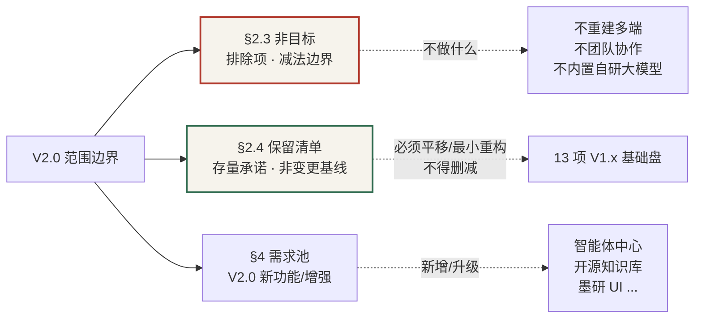

# StudyMind V2.0 产品需求文档（PRD）

> 适用对象：AI 开发 / 架构师 / 工程师
> 文档性质：**规划文档**，描述 V2.0 目标架构与需求，非现状描述。
> 配套产出：完整高保真原型 `StudyMind_V2.0_Prototype_v1.0.html`（huashu-design 产出）

---

## 1. 文档元信息

| 字段 | 值 |
|------|----|
| 产品名称 | StudyMind（墨研 / Ink Scholar 设计语言） |
| 文档版本 | V2.0-PRD v1.0 |
| 日期 | 2026-07-11 |
| 状态 | 完整版（待架构设计补充后评审） |
| 作者 | 产品经理 许清楚（Xu） |
| 关联文档 | V1.x 代码库（src/、backend/app.py、backend/ai_agent.py）、V1.x SKILL.md |
| 后续架构设计 | `StudyMind_V2.0_Architecture_v1.0.md`（架构师补充接口契约、类图、部署） |
| 完整原型 | `StudyMind_V2.0_Prototype_v1.0.html`（前端高保真，统一视觉依据） |

**版本策略**：先交付 PRD + 架构设计，确认后再进入开发（用户明确要求）。本 PRD 与架构师产出需一并评审。
**完整性说明**：本版整合草稿 PRD 与架构评审结论，已补齐「基础功能保留清单（§2.4）」及 5 个需求编号缺口，文档可作为架构师补充架构设计（接口契约、数据结构、部署拓扑）的直接依据。

---

## 2. 产品目标与定位

### 2.1 产品定位
StudyMind 是面向**个人学习者/知识工作者**的 AI 驱动学习管理系统。V2.0 的核心升级是引入**独立运行的 AI 智能体服务**作为系统"大脑"：用户可自定义智能体与 Skill，学习计划/复习计划/知识沉淀均由智能体协作完成；知识底座升级为开源知识库平台（FastGPT / Dify）+ 最新开源向量模型。

### 2.2 产品目标（正交、可衡量）
- **G1 · 智能体化**：所有 AI 能力收敛到"智能体中心"，支持用户自定义智能体（≥1）与自定义 Skill（≥1），记忆按智能体隔离。
- **G2 · 知识可沉淀**：知识沉淀模块提供单一写作面（取消对比模式），用户写大纲→智能体联网补全成稿，或写草稿→智能体润色完善，成稿可追溯引用。
- **G3 · 资讯可信**：资讯爬取引入"维度 + 红线规则"，无正文/不可信源一律不入库、不推荐（硬约束）。
- **G4 · 架构解耦**：AI 智能体成为独立服务；知识库模块可插拔开源底座（FastGPT/Dify），前端零 mock。
- **G5 · 体验升级**：UI 全面美化（墨研设计语言），系统设置精简为「模型配置 + RSS 源管理」两项。
- **G6 · 存量兼容**：V1.x 基础功能全量平移为 V2.0 非变更基线（见 §2.4），全量重写前端时功能不得删减，仅允许实现层重构。

### 2.3 非目标（V2.0 不做）
- 不重建多端 App（V2.0 聚焦 Web）。
- 不做团队协作/多租户（保持个人版）。
- 不内置自研大模型（仅接入第三方，含国内厂商与 Coding Plan）。

> **与非目标的关系（边界澄清）**：§2.3「非目标」= **排除项（减法边界）**，界定 V2.0 不做什么；§2.4「基础功能保留清单」= **存量承诺（非变更基线）**，界定 V1.x 哪些基本盘必须平移。二者**互补**——非目标是"不增加/不扩展的方向"，保留清单是"不可删减的存量"。**凡列入 §2.4 的功能，全量重写时不得因"重新设计"而删减，只能平移或重构实现。**

### 2.4 基础功能保留清单（非变更项）

> **本清单为 V2.0 非变更基线，全量重写时仅允许实现层重构，不得功能删减。**
>
> 处置定义：
> - **完全保留**：功能与核心逻辑不变，仅平移（数据结构/确认逻辑/算法/约束）。
> - **重构保留**：功能保留，实现层重构（CloudBase→data-service、原生 JS→React、直管→网关）。
> - **迁移保留**：数据/链路需迁移脚本（向量重建、CloudBase→Postgres）。

| # | 功能名 | 当前 V1.x 承载 | V2.0 处置 | 对应 V2.0 需求编号 | 说明 |
|---|--------|----------------|-----------|--------------------|------|
| 1 | 分类管理（Categories） | `categories` 集合；`db.js` CRUD | **重构保留**（CloudBase→data-service `/api/db/categories`） | **V2-SET-003（新增 P0）** | 草稿正文原无独立编号，本次补入；基础盘易在全量重写时漏掉 |
| 2 | 知识条目 CRUD + 入库 | `knowledge_items`；`/api/knowledge/*`（ChromaDB 直管） | **重构保留**（元数据→data-service，向量→FastGPT 经 kb-service） | V2-KB-001（AC1 切片向量化、AC3 资讯入库链路） | 条目"纯元数据 CRUD"须单列保留，勿并入"集成平台"而漏掉 |
| 3 | 复习卡 + SM-2 间隔重复 | `review_cards` + `_sm2` 算法 | **SM-2 完全保留**（服务端算法）；卡片管理**重构保留** | **V2-REVIEW-001（补 AC：SM-2 基线完全保留）** + V2-REVIEW-005（P2 可切换） | 基线 SM-2 作为"必须保留基本盘"，本次在 V2-REVIEW-001 显式声明 |
| 4 | 学习计划（目标/里程碑/任务） | `goals/milestones/tasks` + `confirmCreateGoalFromPlan` | **完全保留**（数据结构 + 确认入库逻辑） | V2-PLAN-001（AC2） | 已覆盖 |
| 5 | 出题（题型：选择/填空/问答） | `generateReviewExercises` | **重构保留**（V1.x 题型 → V2-REVIEW-002 扩展） | **V2-REVIEW-002（补 AC：保留 choice/fill/qa 基础题型 P0 基线）** | 基础出题能力本次补为"保留"基线，难度自适应为 P1 增强 |
| 6 | 资讯浏览 / 已读 | `news_items`（`hasRead`） | **完全保留** | V2-NEWS-001/002/003 | "已读"为数据模型隐含字段，保留无变化 |
| 7 | 资讯**收藏** | V1.x 收藏能力 | **完全保留**（数据模型补 `isFavorited:bool`） | **V2-NEWS-004（新增 P0）** | 架构 §5 `NewsItem` 原缺 `isFavorited`，本次补数据模型 + 需求（最严重缺口） |
| 8 | 首页统计（热力图/待复习/薄弱主题/计划统计） | `getStudyHeatmap` / `getTodayReviewStats` / `getWeakTopics` / `getPlanStats` | **完全保留**（聚合接口沿用，前端重写） | **V2-HOME-001（补 AC：复用四个聚合接口为基线）** | 基础统计"保留"本次显式声明，视觉升级不得移除统计维度 |
| 9 | 模型配置基础（多厂商 + Coding Plan） | `settings.html` `PROVIDER_PRESETS` + localStorage | **重构保留**（localStorage→data-service `ai_models` + 服务端密钥） | V2-SET-002 | 已覆盖 |
| 10 | 工程约束：记忆隔离 / 45s 超时 / 引用解耦 / SSRF | V1.x `agent_memory`(agent_id)、`_aiProxy`(45s)、`generate_with_citations`、`_validate_outbound_url` | **完全保留并强化** | V2-AGENT-001 AC2–AC4、§7 约束、§7.3 | 已覆盖（属约束，非"功能清单"项） |
| 11 | 链路：知识条目 → 复习卡 | V1.x 一键生成 | **重构保留**（P1） | V2-REVIEW-004（P1） | 基础链路须声明"基线必须保留"，非仅 P1 增强 |
| 12 | 链路：资讯入库知识库 | V1.x `importNewsToKnowledge` | **完全保留**（链路保留，后端重写为 crawler→kb-service→FastGPT） | V2-KB-001（AC3） | 已覆盖 |
| 13 | RSS 源管理（迁设置） | V1.x 后端已有 RSS 逻辑（附录 A："RSS 管理尚未在设置"） | **重构保留 + 位置变更**（迁系统设置） | V2-NEWS-002 | 已覆盖（属位置迁移） |

**保留基线概览（Mermaid）**



---

## 3. 用户故事（按模块）

| 模块 | 角色 | 故事 |
|------|------|------|
| 智能体中心 | 学习者 | 作为学习者，我希望创建"论文精读官"自定义智能体并绑定 Skill，以便对它说"精读这篇 PDF"时得到结构化解读。 |
| 智能体中心 | 学习者 | 作为学习者，我希望每个智能体的对话记忆相互隔离，以免规划师看到我的写作闲聊。 |
| 学习计划 | 学习者 | 作为学习者，我希望向"学习规划师"描述目标，它联网检索后给出里程碑与任务，我确认即入库。 |
| 复习计划 | 学习者 | 作为学习者，我希望"复习助手"根据我的薄弱主题生成针对性复习计划，并与 SM-2 排程联动。 |
| 知识沉淀 | 学习者 | 作为学习者，我只写大纲，写作助手联网搜索补全成文章；或我写完文章，它帮我润色完善。 |
| 知识沉淀 | 学习者 | 作为学习者，我希望写作区是单一编辑器，不要左右"用户 vs AI"对比那种割裂感。 |
| 资讯 | 学习者 | 作为学习者，我希望只看到有实质正文、来源可信的资讯，标题党/无正文的不出现。 |
| 资讯 | 学习者 | 作为学习者，我希望收藏有价值的资讯，以便后续在收藏夹回顾（V2-NEWS-004）。 |
| 知识库 | 学习者 | 作为学习者，我希望上传文档或资讯入库后能被智能体检索引用，且向量检索更准。 |
| 知识库 | 学习者 | 作为学习者，我希望在知识库里创建/编辑分类，以便组织知识条目与成稿（V2-SET-003）。 |
| 系统设置 | 学习者 | 作为学习者，我希望在设置里直接管理 RSS 源，并配置"无正文不入库"等红线。 |
| 系统设置 | 学习者 | 作为学习者，我希望添加国内厂商模型（含 Coding Plan 套餐）作为默认模型。 |
| 首页 | 学习者 | 作为学习者，我希望首页展示热力图/待复习/薄弱主题/计划统计，一眼掌握学习状态（V2-HOME-001 基线）。 |

---

## 4. 需求池（P0 / P1 / P2）

> 编号规则：`V2-{模块}-{序号}`，模块=AGENT/PLAN/REVIEW/OUTPUT/NEWS/KB/SET/HOME/ARCH/CONS。
> 优先级：P0 必须（MVP）/ P1 应做 / P2 可选。验收标准（AC）须可测量。
> **§2.4 保留清单中的非变更项，其对应需求编号见上表；本池为 V2.0 新增/增强需求，与保留清单互补。**

### 4.1 P0（MVP 必须）

**V2-AGENT-001 · AI 智能体独立服务**
- 描述：将现有 `backend/app.py` 的 `/api/agent/*` 演进为独立"智能体服务"（建议底座 Agno，见 §8 待确认问题），负责对话、记忆隔离、知识检索、工具调用（联网/知识库/代码执行）。
- 验收标准：
  - AC1：服务暴露 `POST /api/agent/chat`、`GET /api/agent/list`、`POST /api/agent`、`DELETE /api/agent/{id}`。
  - AC2：对话记忆按 `agent_id` 隔离（与 V1.x `agent_memory` 一致），跨智能体不可见。
  - AC3：回答须携带知识库引用（citations），无引用时显式说明。
  - AC4：单请求超时 ≤ 45s，超时不重试、不烧 token（沿用 V1.x `_aiProxy` 策略）。

**V2-AGENT-002 · 用户自定义智能体**
- 描述：用户可创建/编辑/删除自定义智能体（名称、系统提示词、绑定 Skill、知识库范围、可用模型）。
- 验收标准：
  - AC1：创建后出现在"智能体中心"列表与对话入口。
  - AC2：自定义智能体记忆同样按 `agent_id` 隔离。
  - AC3：删除自定义智能体时级联清理其记忆。

**V2-AGENT-003 · 用户自定义 Skill**
- 描述：用户可定义 Skill（名称、提示词、可用工具白名单：web_search / knowledge_base / code_exec），供智能体调用。
- 验收标准：
  - AC1：Skill 可被绑定到智能体并在对话中触发。
  - AC2：Skill 元数据持久化（集合 `agent_skills`），非前端写死。

**V2-AGENT-004 · 内置智能体 + 内置 Skill**
- 描述：保留 V1.x 5 个内置智能体（规划师/讲解员/出题教练/复习助手/写作助手），并内置 Skill：全网搜索补全、大纲生成、文章润色完善、复习计划生成、资料推荐。
- 验收标准：AC1：5 个内置智能体 + ≥5 个内置 Skill 默认可用。

**V2-PLAN-001 · 智能体共建学习计划**
- 描述：学习计划由"学习规划师"智能体协作生成（描述目标 → 联网检索 → 生成里程碑/任务 → 用户确认入库）。
- 验收标准：
  - AC1：用户描述目标后，规划师调用联网搜索（web_search Skill）返回带引用的计划草案。
  - AC2：用户"确认并保存"后写入 `goals/milestones/tasks`（复用 V1.x 数据结构与 `confirmCreateGoalFromPlan`，完全保留基线）。
  - AC3：无可用模型配置时返回明确引导，不静默失败。

**V2-REVIEW-001 · 智能体制定的复习计划**
- 描述："复习助手"可基于薄弱主题（mastery<阈值）生成复习计划，并与 SM-2 排程联动。
- 验收标准：
  - AC1：根据用户薄弱主题列表生成针对性复习条目（关联 `review_cards`）。
  - AC2：生成的计划可一键加入复习队列（`batchEnqueueCards` 能力复用）。
  - **AC3（补·基线）：SM-2 间隔重复算法作为 V2.0 完全保留基线（服务端 `_sm2` 算法平移），V2-REVIEW-005 仅在其上增加"可切换 FSRS"选项，不得替换或移除 SM-2 本体。**

**V2-REVIEW-002 · 难度自适应出题**
- 描述：基于 `generateReviewExercises` 扩展题型比例/难度自适应（choice/fill/qa）。
- 验收标准：
  - **AC0（补·基线）：保留 V1.x choice/fill/qa 三种基础题型为 P0 基线，功能与输出结构完全保留；难度自适应（题型比例/难度档）为 P1 增强，不得因增强而删减或改变三种基础题型。**
  - AC1：支持按 `questionTypeRatio` 与 `difficulty`(easy/medium/hard/mixed) 生成。
  - AC2：生成结果可写入复习队列。

**V2-OUTPUT-001 · 集成文本编辑器（取消对比模式）**
- 描述：知识沉淀改用单一富文本编辑器（建议 TipTap/ProseMirror 或等价），移除 V1.x"用户写作 vs AI 写作"对比布局。
- 验收标准：
  - AC1：编辑器为单一写作面，提供基础排版工具（加粗/标题/列表/引用）。
  - AC2：无"左右对比"视图；AI 能力以侧栏面板 + 行内插入方式呈现。
  - AC3：文档写入 `output_docs` 真实集合（非 mock）。

**V2-OUTPUT-002 · 大纲→成稿 / 润色完善**
- 描述：写作助手两种流程：(a) 用户写大纲 → 智能体联网搜索补全成文章；(b) 用户写草稿 → 智能体补全/润色完善。
- 验收标准：
  - AC1：大纲模式生成正文并标注引用来源（[source: 标题]）。
  - AC2：润色模式在原稿上增量修改，可追溯。
  - AC3：生成内容可一键插入编辑器。

**V2-NEWS-001 · 资讯爬取红线规则**
- 描述：升级推荐规则为"明确维度 + 红线规则"，不满足红线一律不入库、不推荐。
- 验收标准：
  - AC1：无正文（或正文 < 最小字数阈值，默认 200）的条目在 `validate` 阶段被丢弃。
  - AC2：命中来源黑名单 / 关键词红线的条目不推荐。
  - AC3：校验逻辑服务端统一执行（复用 `filter_news_items`），前端仅展示结果。

**V2-NEWS-002 · RSS 源管理迁至系统设置**
- 描述：RSS 源管理从资讯模块移入系统设置，支持增删改、健康状态展示、失效告警。
- 验收标准：
  - AC1：设置页「RSS 源管理」可添加/编辑/删除源，持久化到 `rss_sources` 集合。
  - AC2：展示每个源健康状态（健康/延迟/失效）。
  - AC3：爬虫仅抓取设置中启用的源。

**V2-NEWS-004 · 资讯收藏**（新增，补齐 §2.4 #7 缺口）
- 描述：资讯支持收藏/取消收藏，提供收藏夹视图；数据模型补 `isFavorited` 字段。
- 验收标准：
  - AC1：每条资讯卡提供"收藏/取消收藏"入口，操作即时持久化。
  - AC2：`news_items` 数据模型含 `isFavorited:bool`（默认 false）；提供 `GET /api/news/favorites` 收藏列表接口。
  - AC3：收藏状态在列表/详情/收藏夹三处一致，删除资讯同步清理收藏态。
  - AC4：收藏功能完全保留 V1.x 语义，全量重写不得遗漏。

**V2-SET-001 · 系统设置精简**
- 描述：设置仅保留「AI 模型配置」与「RSS 源管理」，移除通知/备份/数据管理（或移至其他入口，本期不做）。
- 验收标准：AC1：设置页仅有上述两节；AC2：模型配置支持国内厂商 + Coding Plan（见 V2-SET-002）。

**V2-SET-002 · 模型配置支持国内厂商 + Coding Plan**
- 描述：模型配置支持 DeepSeek/通义千问/智谱/GLM/Kimi/豆包/小米/MiMo/混元/盘古/阶跃等国内正式版本 + Coding Plan 套餐，以及 Ollama 本地模型。
- 验收标准：
  - AC1：服务商预设覆盖上述厂商，含正确 baseUrl 与 Coding Plan 地址。
  - AC2：可标记 planType=standard/coding/token，Coding Plan 使用独立 API Key。
  - AC3：保存/测试连接流程复用 V1.x settings.html 逻辑（重构保留）。

**V2-SET-003 · 分类管理保留**（新增，补齐 §2.4 #1 缺口）
- 描述：分类管理作为基础盘完全保留，实现层由 V1.x `db.js` 直管重构为 data-service 统一管理。
- 验收标准：
  - AC1：提供 `GET/POST/PUT/DELETE /api/db/categories`，持久化到 `categories` 集合（V1.x 字段沿用：`_id/name/parentId?/sort/createdAt`）。
  - AC2：知识条目、成稿、知识库分类绑定沿用 V1.x 关联逻辑，不得改变分类语义。
  - AC3：分类 CRUD 在知识库/知识沉淀模块前端入口可用，零 mock。

**V2-KB-001 · 集成开源知识库底座**
- 描述：知识库模块接入开源知识库平台（推荐 FastGPT，备选 Dify），由其负责解析/切片/向量化/检索/重排；StudyMind 通过 API 调用（仅检索后端，见 C3 §7.1）。
- 验收标准：
  - AC1：上传文档/资讯入库经知识库平台完成切片与向量化。
  - AC2：智能体检索走知识库平台检索接口（混合检索 + RRF 重排）。
  - AC3：保留"资讯可入库知识库"链路（V1.x `importNewsToKnowledge` 等价）。

**V2-KB-002 · 升级向量模型与向量库**
- 描述：向量模型由 `all-MiniLM-L6-v2`（MTEB 56.3，仅原型用）升级为开源模型；向量库可由 ChromaDB 切换至 Qdrant。
- 验收标准：
  - AC1：默认向量模型 `BGE-M3`（BAAI, MIT, 1024 维, 100+ 语言, 稠密+稀疏+多向量, 中文优化）；可选 `Qwen3-Embedding-8B`（中文最佳）。
  - AC2：向量库抽象可切换 ChromaDB（开发）/ Qdrant（生产）。
  - AC3：提供迁移脚本，将 V1.x ChromaDB 切片重建至新模型/库（迁移保留）。

**V2-CONS-001 · 禁止前端写死 mock 数据**
- 描述：前端所有数据走真实接口/服务，严禁硬编码假数据。
- 验收标准：AC1：全量页面无 `const mockData=`；AC2：未配置服务时显示引导而非假列表。

**V2-CONS-002 · 禁止爬取无正文资讯**
- 描述：无正文的资讯一律不入库、不推荐（与 V2-NEWS-001 红线一致，列为硬约束）。
- 验收标准：AC1：服务端 `validate` 拦截；AC2：前端无绕过入口。

**V2-ARCH-001 · 前端架构升级**
- 描述：前端由原生 JS SPA 升级为组件化框架（建议 React + Vite + TypeScript，或 Vue3；**最终选型待架构师确认**），路由/数据层重构，**保留 V1.x 模块边界、CloudBase 集合与 §2.4 基础功能保留清单**。
- 验收标准：
  - AC1：页面以组件实现，状态集中管理；AC2：数据层统一封装，零 mock；AC3：构建产物可部署（npm run build）。
  - **AC4（强化·基线）：全量重写前端 ≠ 删减基础功能；V1.x 模块边界、CloudBase 集合及 §2.4 保留清单中的 13 项功能均须平移，仅允许实现层重构。**

### 4.2 P1（应做）

**V2-HOME-001 · 首页仪表盘视觉升级（墨研语言）**：热力图、待复习、智能体快捷入口、薄弱主题，沿用 V1.x 数据接口。
- **补 AC（基线）：复用 V1.x 四个聚合接口（`getStudyHeatmap` / `getTodayReviewStats` / `getWeakTopics` / `getPlanStats`）作为统计基线，视觉升级不得移除任一统计维度。**
**V2-REVIEW-003 · 复习日历与连续天数可视化**：日历视图 + 连续天数激励。
**V2-REVIEW-004 · 知识条目自动转复习卡**：从 `knowledge_items` 一键生成 `review_cards`（关联 knowledgeId，基线链路保留）。
**V2-OUTPUT-003 · 知识沉淀与知识库双向联动**：成稿可一键存入知识库分类；知识库条目可"送入写作助手"续写。
**V2-AGENT-005 · 智能体市场/共享**：导出/导入自定义智能体与 Skill 配置（JSON）。
**V2-NEWS-003 · 推荐维度可配置**：相关度/时效性/权威性/完整度/去重权重可在设置调整。
**V2-KB-003 · 知识库可视化分块管理**：参考 FastGPT 的分块预览与手动调整。

### 4.3 P2（可选）
**V2-AGENT-006 · 多模型路由**：智能体按任务选模型（规划用强模型，闲聊用轻模型）。
**V2-REVIEW-005 · 间隔重复算法可切换**（SM-2 / FSRS）：在 SM-2 基线（V2-REVIEW-001 AC3）之上增加可切换项，不得移除 SM-2。
**V2-OUTPUT-004 · 协同写作/版本历史**。
**V2-HOME-002 · 学习数据导出看板**。

---

## 5. UI 设计稿

> 设计原则：从 V1.x 现有模块结构演化（非凭空），避免 AI-slop（无紫渐变、无 emoji 装饰图标、单一强调色、衬线标题）。本规范为后续原型与架构的统一视觉依据。

### 5.1 设计语言「墨研 / Ink Scholar」
- **底色**：暖纸 `#F6F3EC`（非纯白、非渐变）；表面 `#FFFFFF`；墨色文字 `#211C16`；发丝分隔线 `#E4DDD0`。
- **主强调 · 竹青绿** `#2F6B4F`（学者绿，替代 SaaS 蓝/紫）；**信号 · 琥珀** `#C8772E`（进度/高亮，单点使用）；**红线 · 朱砂** `#B23A2E`（警告/拦截，克制）。
- **字体**：标题 `Noto Serif SC` / `Newsreader`（衬线，中文友好）；正文 `Noto Sans SC` / system。
- **布局**：常驻左侧栏（8 模块：首页/学习计划/资讯/知识库/智能体中心/复习计划/知识沉淀/系统设置）+ 顶栏（问候 + 默认模型 + 唤起智能体）。内容区留白充足，发丝线分隔，靠"安静的数据密度"表达 AI 智能（引用、掌握度、连续天数），不堆装饰。
- **反 slop 要点**：无圆角卡片+左彩色边线套路；无 emoji 当图标；强调色唯一；真实微交互（顶栏唤起、智能体切换、红线开关可点）。

### 5.2 关键页面视觉规范（原型已实现）
| 页面 | 关键视觉 |
|------|---------|
| 首页仪表盘 | 4 个统计卡（竹青数字）+ 12 周热力图（4 级绿阶）+ 智能体快捷入口（6 卡，自定义卡用琥珀区分） |
| 智能体中心 | 左：智能体列表（内置 5 + 自定义）；右：详情（头像/描述/记忆隔离徽章/关联 Skill/对话控制台含引用 chip）；Skill 库分系统/用户 |
| 知识沉淀编辑器 | 三栏：文档树 / 单一编辑面（无对比）/ AI 助手面板（步骤追踪：解析大纲→联网→生成→引用） |
| 系统设置 | 仅两节：模型配置（厂商卡 + 已验证态）、RSS 源管理（健康点 + 红线规则开关） |
| 资讯动态 | 左：资讯卡（通过/拦截态，拦截卡虚线+删除线+朱砂原因；**含收藏/取消收藏入口**）；右：推荐维度 + 红线硬约束 |
| 学习计划 | 左：里程碑时间线（规划师生成徽章）；右：智能体协作 5 步 + 确认入库 |
| 知识库 | 分类树（V2-SET-003）+ 条目列表 + 上传入口（沿用 V1.x 布局，重构保留） |

### 5.3 原型链接与说明
- 文件：`StudyMind_V2.0_Prototype_v1.0.html`（本地双击或 `python3 -m http.server` 打开）。
- 交互：左侧栏切换 8 个模块；智能体中心内可切"智能体/Skill 库"、点列表切换智能体；设置页红线开关可点；资讯卡含收藏操作。
- **原型边界**：知识库、复习计划两屏为入口示意（沿用 V1.x 布局），其余为 V2.0 新增/变更模块完整高保真。

---

## 6. 各模块详细规格

> 接口契约为"雏形"，供架构师细化；数据结构在 V1.x CloudBase 集合基础上扩展。

### 6.1 AI 智能体（核心，对应需求 V2-AGENT-001~004）
**功能点**
- 独立智能体服务（由 V1.x `/api/agent/*` 演进，建议底座 Agno，见 §8），前端经统一客户端调用。
- 内置 5 智能体 + 内置 Skill（V2-AGENT-004）；用户自定义智能体/ Skill（V2-AGENT-002/003）。
- 记忆隔离（V1.x `agent_memory` 按 `agent_id`）；回答带知识库引用（V1.x `generate_with_citations`）。
- 工具：web_search（联网）、knowledge_base（检索知识库平台）、code_exec（代码执行，P2）。
- 可被学习计划/复习计划/知识沉淀调用（见 6.2/6.4/6.5）。

**接口契约雏形（智能体服务）**
```
POST /api/agent/chat
  body: { agentId, query, model?, skillIds?, sessionId? }
  resp: { success, data:{ content, citations:[{title,source_doc_id,snippet}], agentId, contextCount } }

GET  /api/agent/list
  resp: { success, data:[{id,name,builtin,skillIds[],desc}] }

POST /api/agent            # 自定义智能体
  body: { name, prompt, skillIds[], knowledgeScope?, model? }
  resp: { success, data:{ id } }

DELETE /api/agent/{id}     # 级联清理记忆

POST /api/skill            # 自定义 Skill
  body: { name, prompt, tools:['web_search'|'knowledge_base'|'code_exec'] }
  resp: { success, data:{ id } }

GET  /api/agent/{id}/memory   # 记忆隔离查看
```

**数据结构雏形**
```js
// agent_skills（新增）
{ _id, name, prompt, tools:[], builtin:bool, createdAt, updatedAt }

// agents（新增，自定义智能体；内置仍由代码常量定义）
{ _id, name, prompt, skillIds:[], knowledgeScope?, model?, builtin:false, createdAt, updatedAt }

// agent_memory（沿用 V1.x：key=agent_id，value=对话历史，隔离）
```

### 6.2 学习计划模块（对应需求 V2-PLAN-001 + 复习 V2-REVIEW-001 协作）
**功能点**
- 与"学习规划师"智能体共建：描述目标 → 联网检索 → 生成里程碑/任务 → 确认入库（V2-PLAN-001）。
- 复用 V1.x `goals/milestones/tasks` 集合与 `confirmCreateGoalFromPlan`（完全保留基线）。
- 复习计划由"复习助手"生成（V2-REVIEW-001），见 6.4。

**接口契约雏形**
```
POST /api/plan/generate      # 规划师智能体生成（内部调用 agent/chat + web_search）
  body: { description, useWebSearch:true, topK:5 }
  resp: { success, data:{ title, description, milestones:[{title,tasks:[]}], recommendedMaterials:[] } }

POST /api/plan/confirm       # 复用 V1.x confirmCreateGoalFromPlan
  body: { plan }
  resp: { success, data:{ goalId } }
```

**数据结构**：沿用 V1.x `goals`(title,description,status,deadline…)、`milestones`(goalId,title,sort,status)、`tasks`(goalId,milestoneId,title,status,deadline…)。

### 6.3 资讯模块（对应需求 V2-NEWS-001/002/004）
**功能点**
- 爬虫增强：服务端逐篇正文抽取（V1.x `_fetch_rss_with_extract` 已做），严禁把 RSS 摘要当正文。
- 推荐规则：维度（相关度/时效性/权威性/完整度/去重）+ 红线（V2-NEWS-001）。
- RSS 源管理迁设置（V2-NEWS-002）；仅抓启用源。
- **资讯收藏（V2-NEWS-004）：`news_items` 补 `isFavorited:bool`，前端卡提供收藏/取消入口。**

**接口契约雏形**
```
POST /api/news/validate      # 红线校验（复用 filter_news_items）
  body: { items:[{title,summary,source,body,sourceUrl}] }
  resp: { success, valid:[], dropped:[{item,reason}] }

POST /api/news/rss           # 抓取+逐篇正文抽取（仅启用源）
  body: { sources:[启用源URL] }

POST /api/news/recommend     # 维度评分 + 红线过滤（P1 可配置权重）
  body: { items, weights? }
  resp: { success, data:[{item, score, passed, dropReason?}] }

GET  /api/news/favorites     # 收藏列表（V2-NEWS-004）
  resp: { success, data:[{...news_items, isFavorited:true}] }

POST /api/news/{id}/favorite     # 收藏/取消收藏切换
  resp: { success, data:{ isFavorited } }

# RSS 源（迁设置）
GET  /api/rss/sources        resp:{ data:[{id,url,enabled,status:'ok'|'warn'|'err',lastFetched}] }
POST /api/rss/sources        body:{ url }  -> 校验可达后入库
PUT  /api/rss/sources/{id}   body:{ enabled,url }
DELETE /api/rss/sources/{id}
```

**数据结构雏形**
```js
// rss_sources（新增）
{ _id, url, enabled:bool, status:'ok'|'warn'|'err', lastFetched, createdAt }

// news_items（沿用 V1.x，补充红线字段 + 收藏字段）
{ _id, title, summary, source, sourceUrl, body, bodyLength,
  passedRedline:bool, dropReason?, recommendScore?,
  hasRead:bool, isFavorited:bool }   // isFavorited 为 V2-NEWS-004 新增
```

**资讯爬取红线规则草案（硬约束，服务端执行）**
| 红线 | 规则 | 动作 |
|------|------|------|
| R1 无正文 | `body` 为空或 `bodyLength < 200`（阈值可配） | 丢弃，不入库 |
| R2 来源不可信 | 命中来源黑名单 / 域名不在白名单 | 不推荐、不入库 |
| R3 关键词红线 | 命中敏感/垃圾关键词 | 拦截 |
| R4 摘要当正文 | 仅有 `summary` 无 `body` | 视为无正文（R1） |
| R5 去重 | 同 `sourceUrl` 或标题相似度 ≥85% | 跳过 |
> 注：R1–R5 在 `validate` 阶段统一拦截；前端仅展示通过与拦截结果，无绕过入口。

### 6.4 复习计划模块（对应需求 V2-REVIEW-001~005）
**升级点（V2-REVIEW-001~004）**
- 智能体制定复习计划："复习助手"基于薄弱主题（mastery<0.5）生成复习条目，一键入队。
- **SM-2 基线完全保留**（V2-REVIEW-001 AC3）：服务端 `_sm2` 算法平移；V2-REVIEW-005 仅在其上增加可切换 FSRS 项。
- **基础题型保留**（V2-REVIEW-002 AC0）：choice/fill/qa 三种题型为 P0 基线，难度自适应为 P1 增强。
- 复习日历 + 连续天数可视化。
- 知识条目→复习卡：从 `knowledge_items` 一键生成 `review_cards`（关联 knowledgeId，基线链路保留）。

**接口契约雏形**
```
POST /api/review/plan-by-agent   # 复习助手生成
  body: { weakTopics:[], goalId? }
  resp: { success, data:{ cards:[{question,answer,questionType,knowledgeId}] } }

POST /api/review/exercises       # 沿用 V1.x，扩展 difficulty 自适应
  body: { cardIds, questionTypeRatio, difficulty:'easy'|'medium'|'hard'|'mixed', count }

POST /api/review/from-knowledge  # 知识条目转复习卡
  body: { itemId }  -> 写入 review_cards(knowledgeId)
```

**数据结构**：沿用 V1.x `review_cards`(question,answer,questionType,knowledgeId,mastery,interval,nextReview…)、`review_history`。

### 6.5 知识沉淀模块（对应需求 V2-OUTPUT-001~003）
**功能点**
- 单一富文本编辑器（V2-OUTPUT-001，取消对比模式）。
- 两种 AI 流：大纲→成稿（写作助手联网补全 + 引用）、草稿润色完善（V2-OUTPUT-002）。
- 与知识库双向联动（V2-OUTPUT-003，P1）。

**接口契约雏形**
```
POST /api/output/generate        # 大纲→成稿（内部调用 agent/chat + web_search）
  body: { outline, title, categoryId? }
  resp: { success, data:{ content, citations:[] } }

POST /api/output/refine          # 润色/补全
  body: { content, instruction? }
  resp: { success, data:{ content } }

# 双向联动（P1）
POST /api/output/{id}/to-knowledge  body:{ categoryId }  -> 存入知识库
```
**数据结构**：沿用 V1.x `output_docs`(title,content,status:'draft'|'published',summary…)。

### 6.6 系统设置（对应需求 V2-SET-001/002）
**功能点**
- 仅「AI 模型配置」+「RSS 源管理」（V2-SET-001）。
- 模型配置支持国内厂商 + Coding Plan（V2-SET-002，重构保留 V1.x settings.html 预设与测试连接）。
- RSS 管理接口见 6.3。

**数据结构**：`ai_models`(provider,planType,modelName,baseUrl,apiKey,status…) 由 V1.x localStorage 重构保留至 data-service；`rss_sources` 见 6.3。

### 6.7 知识库模块（对应需求 V2-KB-001~003）
**功能点**
- 集成开源知识库平台：推荐 **FastGPT**（中文优化 RAG、混合检索+RRF 重排、15 分钟部署、4C8G、低运维）；备选 **Dify**（完整 Agent/工作流平台、50+ 工具、较重）。**最终选型待架构师/用户拍板**。
- 向量模型：`BGE-M3`（默认，MIT，中文优化）或 `Qwen3-Embedding-8B`（中文最佳，Apache 系）；淘汰 `all-MiniLM-L6-v2`（仅原型）。
- 向量库：ChromaDB（开发）/ Qdrant（生产，过滤与扩展更优）；Milvus（大规模备选）。
- 保留资讯入库知识库链路（等价 `importNewsToKnowledge`）。
- **分类管理（V2-SET-003）：`categories` 经 data-service `/api/db/categories` 重构保留。**

**接口契约雏形（知识库网关，封装 FastGPT/Dify）**
```
POST /api/kb/upload        # 上传文档 -> 平台解析/切片/向量化
POST /api/kb/search        # 混合检索 + RRF 重排 -> 返回 chunks+citations
POST /api/kb/chunks/{id}
DELETE /api/kb/{id}
POST /api/kb/ingest-news   # 资讯入库（红线通过后）

# 分类管理（V2-SET-003）
GET    /api/db/categories        resp:{ data:[{_id,name,parentId?,sort,createdAt}] }
POST   /api/db/categories        body:{ name, parentId? }
PUT    /api/db/categories/{id}   body:{ name, parentId? }
DELETE /api/db/categories/{id}
```
**数据结构**：知识条目元数据仍存 CloudBase `knowledge_items`（与 V1.x 兼容）；`categories` 集合沿用 V1.x 字段；向量与切片由知识库平台管理。

### 6.8 首页（对应需求 V2-HOME-001 基线 + 视觉升级）
- **复用 V1.x 四个聚合接口作为统计基线**（V2-HOME-001 补 AC）：`getStudyHeatmap` / `getTodayReviewStats` / `getWeakTopics` / `getPlanStats`，视觉升级不得移除任一统计维度。
- 视觉升级为墨研语言（V2-HOME-001）；智能体快捷入口跳转智能体中心。

### 6.9 前端架构升级（对应需求 V2-ARCH-001）
- 组件化框架（建议 React + Vite + TS，或 Vue3；选型待架构师确认），路由/数据层重构。
- **强化基线（AC4）：全量重写 ≠ 删减基础功能；V1.x 模块边界、CloudBase 集合与 §2.4 保留清单 13 项均须平移。**

---

## 7. 约束与红线

### 7.1 硬约束（开发必须遵守）
- **C1 · 禁止前端写死 mock 数据**：所有页面数据走真实接口/服务（CloudBase / 智能体服务 / 知识库平台 / 爬虫服务）。未配置服务时显示明确引导，不得用假列表填充。（对应 V2-CONS-001）
- **C2 · 禁止爬取无正文资讯**：无正文的资讯一律不入库、不推荐。服务端 `validate` 统一拦截，前端无绕过入口。（对应 V2-CONS-002 / 资讯红线 R1/R4）
- **C3（评审建议·待架构文档落定）· 禁用 FastGPT Agent 应用模块**：FastGPT 仅用作无状态知识库检索后端（经 kb-service `/api/kb/*`），**不得启用其 Agent 应用 / 技能(插件) / 多轮记忆编排**；所有智能体编排、记忆、工具、密钥统一收敛于 agent-service（建议底座 Agno），避免双记忆/双编排/密钥分散。详见 §8 待确认问题 #11 与架构评审结论。

### 7.2 资讯爬取红线规则（草案，服务端执行）
- R1 无正文（`body` 空或 <200 字）→ 丢弃
- R2 来源不可信（黑名单/非白名单）→ 不推荐
- R3 关键词红线命中 → 拦截
- R4 仅有摘要无正文 → 视为无正文（R1）
- R5 去重（同 URL / 标题相似 ≥85%）→ 跳过
> 红线开关与阈值（200 字、黑名单、关键词）在系统设置「RSS 源管理」下的红线规则区配置（原型已实现开关 UI）。

### 7.3 其他工程约束
- 智能体对话超时 ≤45s，超时不重试（防烧 token，沿用 V1.x）。
- 记忆严格按 `agent_id` 隔离，跨智能体不可见（§2.4 #10 完全保留并强化）。
- 所有 AI 回答尽量带可溯源引用（citations）；无引用显式说明。
- 前端零 mock；构建产物可部署（npm run build）。
- **SM-2 间隔重复算法完全保留为基线（V2-REVIEW-001 AC3）**，算法本体不替换、不移除。

---

## 8. 待确认问题（需主理人/架构师/用户拍板）

1. **前端框架选型**（V2-ARCH-001）：React+Vite+TS 还是 Vue3？现有原生 JS SPA 是否全量重写？影响工作量与排期。
2. **开源智能体底座**（V2-AGENT-001）：V2.0 "AI 智能体是单独服务"——是在 V1.x FastAPI `/api/agent` 上演进，还是引入第三方 Agent 框架？架构评审**推荐 Agno 作为智能体大脑（agent-service）**，自定义 Skill 的执行沙箱如何做（尤其 code_exec）？
3. **知识库平台选型**（V2-KB-001）：FastGPT（推荐，中文/轻量）还是 Dify（强 Agent/工作流）？私有化部署资源（FastGPT 4C8G vs Dify 8C16G）是否就绪？
4. **向量模型与向量库**（V2-KB-002）：默认 BGE-M3 还是 Qwen3-Embedding-8B？向量库 ChromaDB→Qdrant 的迁移成本与运维归属？
5. **模型配置存储**：V1.x 模型配置在 localStorage，V2.0 是否迁 data-service（多端同步/安全）？（V2-SET-002 重构保留）
6. **Coding Plan 模型**：需明确各家 Coding Plan 的实际可用模型名与 Key 获取方式（settings.html 已有 planType 字段，待补真实地址）。
7. **知识沉淀编辑器选型**（V2-OUTPUT-001）：TipTap / ProseMirror / 其他？是否需协同（P2）？
8. **范围与排期**：P0 是否即为 V2.0 首发范围？P1（复习日历、知识库双向联动等）是否同版或后续小版本？
9. **数据迁移**：V1.x ChromaDB（all-MiniLM）切片与 CloudBase 数据如何平滑迁移到 V2.0（尤其向量模型更换需重建索引）。
10. **智能体市场**（V2-AGENT-005，P1）：自定义智能体/Skill 的导出导入格式与分享范围。
11. **FastGPT Agent 模块是否启用 —— 架构评审已建议定为「禁用（C3 硬约束）」**：评审结论明确"Agno 做大脑 + FastGPT 仅作无状态知识库检索后端"成立且应被显式固化；**不启用 FastGPT 的 Agent 应用/技能/多轮记忆编排**，以避免双记忆、双编排、密钥分散三重风险（详见架构评审 R-1~R-8 风险清单）。**此约束待架构师在 `StudyMind_V2.0_Architecture_v1.0.md` 落定为硬约束 C3。**

---

## 附录 A · V1.x 现状要点（理解背景，非需求）
- 前端：原生 JS SPA（framework.js 路由 → fetch pages/*.html；db.js 数据层；注意 `importNewsToKnowledge`/`ignoreNews` 共用，`switchKbTab` 依赖 `clearBatchSelection`/`updateBatchBar`）。
- 后端：FastAPI :8765（知识上传/切片/搜索、RSS 抽取、5 内置智能体+记忆隔离、news validate/rss/extract）。
- 知识：CloudBase 集合（categories/knowledge_items 等）+ ChromaDB（all-MiniLM-L6-v2）。
- 设置：已支持多厂商国内模型 + Coding Plan（settings.html）；RSS 管理尚未在设置。
- 资讯：已有 `filter_news_items` 无正文过滤（红线雏形）；**收藏能力存在，但 `news_items` 需补 `isFavorited` 字段**（V2-NEWS-004）。
- 输出：已有 outline/expand/refine/review，但为"用户 vs AI 对比"模式（V2.0 取消）。
- 复习：`review_cards` + `_sm2` 算法；`generateReviewExercises` 支持 choice/fill/qa 三题型（V2.0 基线保留）。

## 附录 B · 事实依据（2026-07 验证）
- 开源向量模型：BGE-M3（BAAI, MIT, 1024 维, 100+ 语言, 稠密+稀疏+多向量, 中文优化, 生产 RAG 最常用）；Qwen3-Embedding-8B（Apache 系, ~119 语言, 中文最佳）；GTE-Qwen2-7B（Apache 2.0）；Nomic Embed v2；Jina v5-text-small。
- 向量库：ChromaDB（简单）、Qdrant（生产过滤/扩展）、Milvus（大规模）。
- 知识库平台：FastGPT（中文优化 RAG、混合检索+RRF 重排、约 89% 准确率、15 分钟部署、4C8G、低运维）；Dify（可视化工作流、50+ 工具、Agent 框架、较重部署）。
- 智能体底座：Agno（纯 Python MIT，自托管无平台绑定，记忆/工具/Skill 运行时装配灵活，契合"规划师看不到写作闲聊"的 agent_id 级隔离）；FastGPT Agent 应用（绑平台、隔离粒度弱、密钥分散，评审建议不启用其 Agent 模块）。

---

> 文档产出：产品经理 许清楚（Xu）｜版本 V2.0-PRD v1.0｜日期 2026-07-11
> 整合依据：草稿 `StudyMind_V2.0_PRD.md` + 架构评审 `StudyMind_V2.0_Architecture_Review.md`
> 关联文档：`StudyMind_V2.0_Architecture_v1.0.md`（待架构师补充）、`StudyMind_V2.0_Prototype_v1.0.html`（高保真原型）
