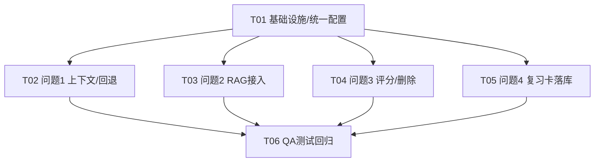

# StudyMind 四个必修复 Bug — 修复方案与任务分解（架构设计）

> 架构师：高见远（software-architect）
> 面向：主理人齐活林 / Engineer / QA
> 硬约束：所有 LLM 调用统一使用 **Hy3** 模型；4 个问题全部修复且单元测试通过后交付；不遗漏任何问题。

---

## 0. 总览与统一约定（共享知识）

### 0.1 模型统一收敛（硬约束）
- 在 `src/js/config.js` 的 `CONFIG` 增加 `ai: { model: 'Hy3' }`，并导出全局常量 `AI_MODEL = CONFIG.ai.model`（同时挂 `window.AI_MODEL`）。
- `src/js/ai-service.js` 新增 `getActiveModelId()` → 返回 `AI_MODEL`；`callAI(params)` 的 `model` **缺省值**改为 `getActiveModelId()`；`getDefaultModel()` 在模型列表为空/无默认时回退到 `AI_MODEL`。
- `src/js/db.js`：
  - `_aiProxy(data)` 调 `AIService.callAI(data)` 时不传 `model`（自动走 Hy3）；云函数回退分支 `ai-proxy` 的 data 补 `model: 'Hy3'`。
  - `sendMessageAndReply(chatId, content, model)` 默认参数由 `'mimo'` 改为 `AI_MODEL`。
- `src/pages/ai-chat.html`：`chatState.currentModel` 初始化为 `AI_MODEL`；模型下拉默认选中 Hy3。
- **不可接受**：任何位置硬编码 `'mimo'` / `'gpt'` / 其他模型名。所有 AI 入口必须经 `callAI` 或 `_aiProxy`。

### 0.2 聊天状态持久化（问题1基础）
- 把 `chatState` 从"每次进入页面重建的局部 var"改为**跨挂载单例 + localStorage 持久化**：
  - 单例：声明改为 `window.__chatState = window.__chatState || { ...默认 ... }`（framework.js 的 `executeScripts` 重复 append 也不会重置）。
  - 持久化：`currentAgent`、`currentChatId` 写入 `localStorage['studymind.chat.agent']` / `['studymind.chat.current']`；提供纯函数 `loadChatSession()` / `saveChatSession({currentAgent, currentChatId})`（见 `src/js/chat-session.js`）。
  - 恢复时机：`initAiChatPage()` 开头调 `restoreChatSession()` → 读 localStorage 写回单例并刷新 UI（`renderAgentSelector()`；若 `currentChatId` 存在则 `selectChat(currentChatId)`）。
  - 写入时机：用户切换智能体 / 创建或选择对话 / 发送成功后。

### 0.3 检索流程（问题2基础）
- 在 `sendMessage` 中按 agent 类型插入"先 `searchKnowledgeChunks` 再 `searchWeb` 兜底"的通用步骤：
  - `shouldUseRAG(agentId)`（`src/js/rag.js` 纯函数）：learning-coach / review-coach / kb-butler / news-butler → `true`；general → `false`（可由 CONFIG 开关覆盖）。
  - `retrieveContext(agentId, query, deps)`：① `kb = deps.DB.searchKnowledgeChunks(query, topK, minSim)`；② 若 `needsWebFallback(kb)` 则 `web = deps.DB.searchWeb(query, topK)`；③ `formatRAGContext(kb, web)` 生成文本。
  - 注入位置：拼到 agent system prompt 末尾（专家分支与普通分支统一走同一条拼装路径）。
  - `formatRAGContext(kbChunks, webChunks)` 为纯函数（拼接字符串），可单测。

---

## 1. 逐问题设计

### 问题1：AI 多智能体切换丢上下文 + 自动回退"普通专家"
**根因确认（已核对源码）**
- `src/pages/ai-chat.html` 内联 `<script>`（508 行起）每次由 `framework.js:98-145` 的 `loadPageContent→executeScripts` 重新 append 到 `<head>` 执行 → `var chatState = {currentAgent:'general',...}`（514-522）被反复重建为默认。
- `initAiChatPage`（555 行）初始化**不恢复** agent；仅 `selectChat`（1146-1149）在显式选对话时从 `chat.agentId` 恢复，初始进入不触发 → 离开再回变回 general。
- 专家分支 `sendMessage`（1387-1394）只发 `[{system},{user:当前消息}]`，**不含历史**；普通分支 `DB.sendMessageAndReply` 带完整历史 → 专家对话"无记忆"。

**推荐方案**
1. 单例化 + 持久化 `chatState`（见 0.2）。
2. `initAiChatPage` 恢复会话（agent + currentChatId + 历史渲染）。
3. 专家分支改为：`history = await DB.getMessages(chatState.currentChatId)` → `messages = buildAgentMessages(history, systemPrompt, finalContent)`（历史 + system + 当前用户消息），再 `AIService.callAI`。
4. 切换 agent 时：更新 `chatState.currentAgent` + 持久化 + 写 `chats` 文档 `agentId`（保证 `selectChat` 也能恢复）。

**关键改动文件 / 改动要点**
- `src/pages/ai-chat.html`：
  - chatState 声明改为 `window.__chatState = window.__chatState || {currentChatId:null, currentModel:AI_MODEL, currentAgent:'general', inflightCount:0, conversations:[], pendingFiles:[], selectedKnowledgeIds:[]}`。
  - 新增 `restoreChatSession()`：读 localStorage → 写回 `window.__chatState` → `renderAgentSelector()` → 若 `currentChatId` 则 `selectChat(currentChatId)`；`initAiChatPage` 开头调用。
  - `sendMessage` 专家分支：`const history = await DB.getMessages(chatState.currentChatId); const msgs = window.AIService.buildAgentMessages(history, agentPrompt, finalContent);` 替换写死的两条消息。
  - agent 切换/创建/选择对话处调 `saveChatSession(...)`。
- `src/js/chat-session.js`（新增）：`getChatState()` / `loadChatSession()` / `saveChatSession()` / `restoreChatSession()`（纯函数 + localStorage 封装，双导出）。
- `src/js/ai-service.js`：`buildAgentMessages(history, systemPrompt, userContent)` 暴露为可测纯函数。

### 问题2：知识库 RAG 未在聊天生效
**根因确认**：`sendMessage` 从不调用 `searchKnowledgeChunks`/`searchWeb`；`learning-coach`/`review-coach` 的 `injectLearningContext/injectReviewContext` 只注入 goals/tasks/review，不碰知识库；RAG 后端（`backend/chunker.py`、`embedder.py`、`vector_store.py`、`app.py:345-372`）与 `db.js:1749 searchKnowledgeChunks` 真实可用但聊天侧未接线。

**推荐方案**
1. `src/js/rag.js` 新增纯函数 `shouldUseRAG` / `needsWebFallback` / `formatRAGContext` / `retrieveContext`（retrieveContext 通过注入的 `deps.DB` 调用，便于桩测试）。
2. `sendMessage` 中：确定 agent 后若 `shouldUseRAG(agentId)` 则 `const rag = await retrieveContext(agentId, finalContent, {DB: window.DB, cfg: CONFIG.kbBackend})` 并拼到 system prompt。
3. RAG 在页面 `sendMessage` 层注入（依赖每条用户消息的 query），不改 `buildAgentSystemPrompt`。

**关键改动文件 / 改动要点**
- `src/js/rag.js`（新增）：上述纯函数；`retrieveContext(agentId, query, deps)` 内 `deps.DB.searchKnowledgeChunks` 优先，`needsWebFallback(kb)` 为真才 `deps.DB.searchWeb`。
- `src/pages/ai-chat.html`：`sendMessage` 通用拼装：
  ```
  let systemPrompt = agentId === 'general' ? AGENT_PROMPTS.general : await AIService.buildAgentSystemPrompt(agentId);
  if (shouldUseRAG(agentId)) {
    const rag = await retrieveContext(agentId, finalContent, { DB: window.DB, cfg: CONFIG.kbBackend });
    systemPrompt += '\n\n' + rag;
  }
  const history = await DB.getMessages(chatState.currentChatId);
  const msgs = buildAgentMessages(history, systemPrompt, finalContent);
  ```
- `src/js/ai-service.js`：`callAI` 默认 Hy3（见 0.1）；可选把 RAG 注入标准化为 `injectRAGContext`，但本方案放在页面层即可。
- `needsWebFallback(kbChunks)`：kb 为空 / 有效条数 < 阈值（如 topK/2） / 平均相似度 < minSim → `true`。

### 问题3：资讯 AI 评分不全 + 无来源未删除
**根因确认**：`_aiScoreNewsAsync`（2485）sourceUrl 为空也给默认 50 入库；删除入口（`batchDeleteNews:2603` / `permanentDeleteNews:2625` / `functions/data-cleanup/index.js:46`）均无"无来源即删"；缺去重 / 最小长度 / 软文广告 / 作者权威性 / 可读性维度。

**推荐方案**
1. 新增 `src/js/news-scorer.js`（纯函数，无 window/网络依赖，双 CommonJS/window 导出便于 Node 单测）：
   - `evaluateNews(raw)` → `{score, level, dims:{信源,价值,关联,新鲜,可转化}, flags:{hasSource, tooShort, isAd, isDuplicate, lowAuthority, lowReadability}}`
   - `decideDisposition(evaluation, raw)` → `{action:'delete'|'keep', score, level, reason}`（纯决策，**单测核心**）
   - `isAdOrPromo(text)` / `classifyReadability(text)` / `authorityScore(domain)` / `dedupe(news, existing)` 等纯函数。
2. `_aiScoreNewsAsync` 重构：先 `evaluateNews` → 若 `decideDisposition.action==='delete'`（无解来源 / 过短 / 广告 / 重复）则 `await permanentDeleteNews(newsId)` 并返回；否则用 AI 结果或纯分更新 `news_items`。
3. `addManualNews`（2450）：入库后同样跑 `decideDisposition`，无来源则删除（或入库即校验拒绝并提示）。
4. `dailyCrawlAndScore`（2219）：抓取写库前对每条跑 `decideDisposition`，无来源 / 广告 / 重复直接丢弃不入库。
5. 新增 `DB.deleteNewsWithoutSource()` 供历史清理（按需触发，不在本次强制全量）。

**关键改动文件 / 改动要点**
- `src/js/news-scorer.js`（新增）：以上纯函数。
- `src/js/db.js`：`_aiScoreNewsAsync` / `addManualNews` / `dailyCrawlAndScore` 接线 `news-scorer`；新增 `deleteNewsWithoutSource()`。
- `src/pages/news.html`（可选）：无来源被删后 toast 提示。
- 硬规则（无论 AI 怎么说）：`!flags.hasSource` 或 `flags.tooShort` 或 `flags.isAd` 或 `flags.isDuplicate` → `action:'delete'`。软维度（权威/可读/广告软分）参与 `score` 计算但不直接删除（除非 `isAd` 命中）。最终删除判定以纯规则为准，保证可测、可控。

### 问题4：复习卡片从未生成
**根因确认**：`db.js:1896 aiGenerateReviewCards` 仅返回 `_aiProxy` 文本，不解析、不调 `createReviewCard`；`knowledge.html:1795` 成功分支只 `toast('成功')` 从不持久化，且 try/catch 吞异常误报成功；`review.html` 无入口；`plan.html:1328` `createReviewCard({knowledgeId: taskId})` 误用 taskId 作 knowledgeId。

**推荐方案**
1. 新增 `src/js/review-card-parser.js`（纯函数）：`parseReviewCards(aiText)` → `[{front, back, type, hint?}]`（从 AI 文本抽取 JSON 数组，容错）。
2. `db.js:aiGenerateReviewCards(itemId)` 重构为**编排函数**（可单测）：
   - `const aiResult = await this._aiProxy({action:'generate-cards', itemId})`
   - `const cards = parseReviewCards(aiResult.content)`
   - 逐张 `await this.createReviewCard({...card, knowledgeId: itemId})`
   - 返回 `{success:true, count: cards.length, ids:[...]}`
3. `knowledge.html:generateReviewCard`：依据 `res.success && res.data.count>0` 决定成功/失败 toast；**移除误报成功的 try/catch 吞异常**（失败要真实抛出/显示）。
4. `review.html`：新增"生成复习卡片"按钮 + 处理函数（选知识条目后调 `DB.aiGenerateReviewCards(knowledgeId)`）。
5. `plan.html:1328`：`knowledgeId: taskId` → 改为真实 `knowledgeId`（从任务关联知识项取；无则不加该字段）。

**关键改动文件 / 改动要点**
- `src/js/review-card-parser.js`（新增）：`parseReviewCards`。
- `src/js/db.js`：`aiGenerateReviewCards` 解析 + 落库。
- `src/pages/knowledge.html`：成功/失败处理修正。
- `src/pages/review.html`：新增入口。
- `src/pages/plan.html`：`createReviewCard` knowledgeId 修正。

---

## 2. 文件列表（相对路径）

新增 / 修改：
- `src/js/config.js`（改：增加 `AI_MODEL='Hy3'` 与 RAG / 持久化配置）
- `src/js/ai-service.js`（改：`getActiveModelId()` + `callAI` 默认 Hy3 + 暴露 `buildAgentMessages`）
- `src/js/chat-session.js`（新：会话单例 + 持久化 + 恢复，纯函数 + localStorage 封装）
- `src/js/rag.js`（新：`shouldUseRAG` / `needsWebFallback` / `formatRAGContext` / `retrieveContext`）
- `src/js/news-scorer.js`（新：纯评分 / 决策函数）
- `src/js/review-card-parser.js`（新：`parseReviewCards`）
- `src/js/db.js`（改：`_aiProxy` 默认模型、`aiGenerateReviewCards` 落库、`_aiScoreNewsAsync` 接 news-scorer、`addManualNews` / `dailyCrawlAndScore` 校验、`deleteNewsWithoutSource`）
- `src/pages/ai-chat.html`（改：问题1 + 问题2）
- `src/pages/knowledge.html`（改：问题4 前端）
- `src/pages/review.html`（改：问题4 入口）
- `src/pages/plan.html`（改：问题4 knowledgeId 修正）
- `src/pages/news.html`（改：可选 toast）
- `tests/unit/rag.test.js`、`tests/unit/chat-session.test.js`、`tests/unit/news-scorer.test.js`、`tests/unit/review-card-parser.test.js`、`tests/unit/db-ai.test.js`（新：纯 Node + jsdom 桩，不依赖真实 CloudBase / 网络）

---

## 3. 任务列表（有序、依赖、按实现顺序）

> 工程任务 T01–T05 各自 ≥3 文件，仅依赖 T01，可并行推进；T06 为 QA 测试回归。

### T01 — 项目基础设施 / 统一配置（P0，依赖：无）
- **文件**：`config.js`、`ai-service.js`、`chat-session.js`、`rag.js`、`news-scorer.js`、`review-card-parser.js`
- **内容**：
  1. `config.js` 增加 `AI_MODEL='Hy3'` 与 `kbBackend` / 持久化 key 配置。
  2. `ai-service.js` 增加 `getActiveModelId()`，`callAI` 默认 Hy3，`buildAgentMessages` 暴露。
  3. 新建四个纯逻辑模块（双 CommonJS / window 导出，便于 Node 单测），定义模块间调用契约与注入接口（`deps.DB`）。
- **优先级**：P0

### T02 — 修复问题1：多智能体丢上下文 / 回退（P0，依赖：T01）
- **文件**：`ai-chat.html`、`chat-session.js`、`ai-service.js`
- **内容**：chatState 单例 + localStorage 持久化；`initAiChatPage` 恢复；专家分支带历史；agent 切换持久化。
- **优先级**：P0

### T03 — 修复问题2：RAG 接入聊天（P0，依赖：T01）
- **文件**：`rag.js`、`ai-chat.html`、`ai-service.js`
- **内容**：`sendMessage` 中按 agent 调 `retrieveContext` 注入 KB + web 兜底（先 KB 后 web）。
- **优先级**：P0

### T04 — 修复问题3：资讯评分 + 无来源删除（P0，依赖：T01）
- **文件**：`news-scorer.js`、`db.js`、`news.html`
- **内容**：纯评分 / 决策；`_aiScoreNewsAsync` / `addManualNews` / `dailyCrawlAndScore` 接线；无来源即删。
- **优先级**：P0

### T05 — 修复问题4：复习卡片生成落库（P0，依赖：T01）
- **文件**：`review-card-parser.js`、`db.js`、`knowledge.html`、`review.html`、`plan.html`
- **内容**：`aiGenerateReviewCards` 解析 + 落库；`knowledge.html` 修正 toast；`review.html` 入口；`plan.html` knowledgeId 修正。
- **优先级**：P0

### T06 — 单元测试与回归（负责人：QA，依赖：T01–T05）
- **内容**：运行 `tests/unit/*`；4 个问题对应断言不过则退回对应 T 继续修，直到全部通过。
- **优先级**：P0



---

## 4. 依赖包
- **运行时**：无需新增。
- **测试**：复用现有 `jsdom`（已安装，通过 NODE_PATH 引入）。建议保持与现有 `tests/home-rewrite.smoke.test.js` 一致——**纯 Node + jsdom + 手动 assert 收集器 / `node:test`**，无需新包（Node 18+ 内置 `node:test`）。
- 可选：若团队偏好，可引入 `vitest` 作运行器（非必须）。
- `package.json` 的 `test` 脚本建议改为：`node tests/unit/rag.test.js && node tests/unit/chat-session.test.js && node tests/unit/news-scorer.test.js && node tests/unit/review-card-parser.test.js && node tests/unit/db-ai.test.js`（或 `node --test tests/unit`）。

---

## 5. 可测试性设计 + 单元测试计划

**设计原则**：所有判定逻辑抽成**不依赖 window / CloudBase / 网络**的纯函数，放在可 `require` 的双导出模块；`DB` / `AIService` 通过参数注入（`deps`）以便桩测试。

### 问题1 测试
- `tests/unit/chat-session.test.js`（纯 Node）：
  - `loadChatSession()` 默认返回 `{currentAgent:'general', currentChatId:null}`。
  - `saveChatSession({currentAgent:'learning-coach', currentChatId:'c1'})` 后 `loadChatSession()` 返回该值（用内存 localStorage 桩）。
  - 单例幂等：连续两次 `getChatState()` 返回同一对象引用。
- `ai-chat` 集成（jsdom + 桩 DB）：`initAiChatPage` 调用后，若 localStorage 有 agent，UI 选中态正确；`buildAgentMessages(history, sys, user)` 产出 `[...history, {role:'system'}, {role:'user'}]`。

### 问题2 测试
- `tests/unit/rag.test.js`（纯 Node）：
  - `shouldUseRAG('learning-coach')===true`，`shouldUseRAG('general')===false`（可由 CONFIG 覆盖）。
  - `needsWebFallback([])===true`；`needsWebFallback([{similarity:0.8}])===false`；低于阈值 → true。
  - `formatRAGContext(kbChunks, webChunks)` 输出包含 KB 片段文本与 web 来源，且 KB 在前。
  - `retrieveContext(agentId, query, {DB: stub})`：stub `searchKnowledgeChunks` 返回空 → 断言 `searchWeb` 被调用（降级分支）；返回非空 → 断言 `searchWeb` 未被调用。

### 问题3 测试
- `tests/unit/news-scorer.test.js`（纯 Node）：
  - `evaluateNews({title:'x', content:'...', sourceUrl:''})` → `flags.hasSource===false`。
  - `decideDisposition(evaluation({hasSource:false}))` → `{action:'delete', reason:'no-source'}`（**核心断言**）。
  - `decideDisposition(evaluation({hasSource:true, tooShort:true}))` → `delete`。
  - `isAdOrPromo('限时折扣 点击购买 加微信')` → true；正常技术文 → false。
  - `dedupe(item, [sameUrlItem])` → true；不同 → false。
  - 正常有来源且达标 → `{action:'keep', score, level}`。
- `db` 集成（桩 DB，jsdom）：`_aiScoreNewsAsync` 对无来源项最终调用 `permanentDeleteNews` 而非 `news_items.update`。

### 问题4 测试
- `tests/unit/review-card-parser.test.js`（纯 Node）：
  - `parseReviewCards('...{"front":"Q","back":"A"}...')` → `[{front:'Q', back:'A'}]`。
  - 含 markdown 代码块 / 多张 → 正确解析数组。
  - 无法解析 → `[]`（不抛）。
- `db` 集成（桩 DB，jsdom）：`aiGenerateReviewCards(itemId)` 用 stub `_aiProxy` 返回含 JSON 文本 + stub `createReviewCard` → 断言 `createReviewCard` 被调用 N 次且每次 `knowledgeId===itemId`，返回 `{count:N}`。

### 模型收敛测试（横切）
- 任意调用 `AIService.callAI({action:'chat', messages:[...]})`（桩 fetch）断言请求体 `model === 'Hy3'`。
- `db._aiProxy` 不传 model 时最终 `callAI` 收到 `model==='Hy3'`。

---

## 6. 待明确事项
- **历史资讯清理**：本次"无来源即删"仅对新评分 / 新录入生效；历史数据的一次性清理由 `deleteNewsWithoutSource()` 提供，是否立即全量执行由主理人决定（建议列为独立数据维护任务，不计入本次 4 Bug 修复范围）。
- **`shouldUseRAG('general')`** 默认 false；若希望通用助手也走 KB 检索，改 CONFIG 开关即可，不影响代码结构。
- **复习卡片定时生成**不在 4 Bug 内，本次仅修复手动 AI 生成落库与入口。
- 除上述外无实质歧义，按上述合理默认实现。
